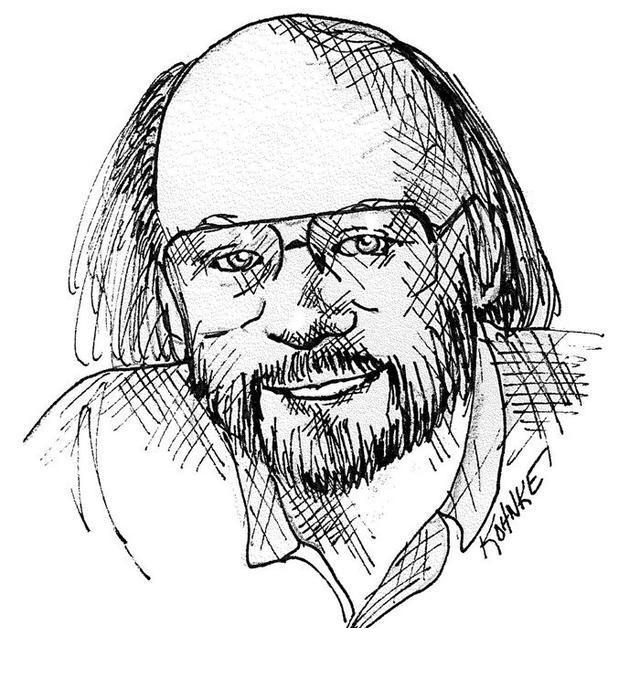
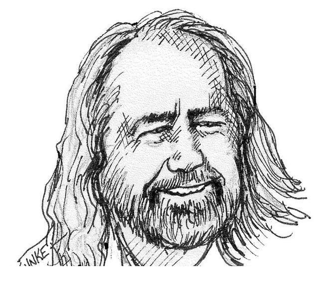
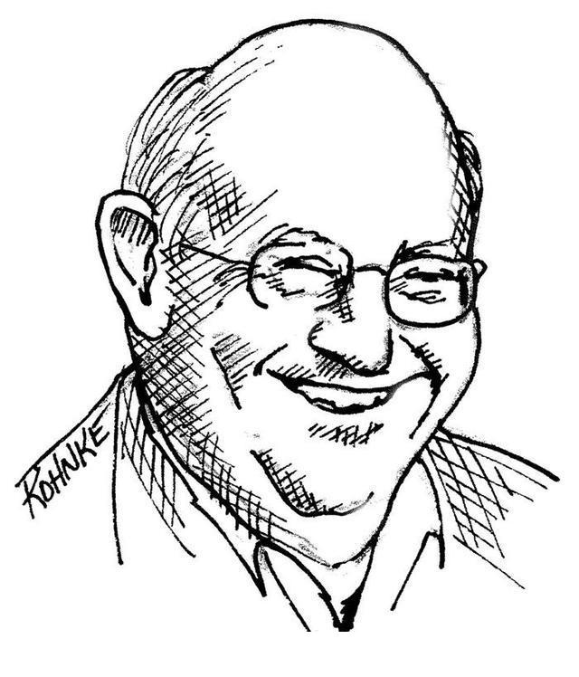
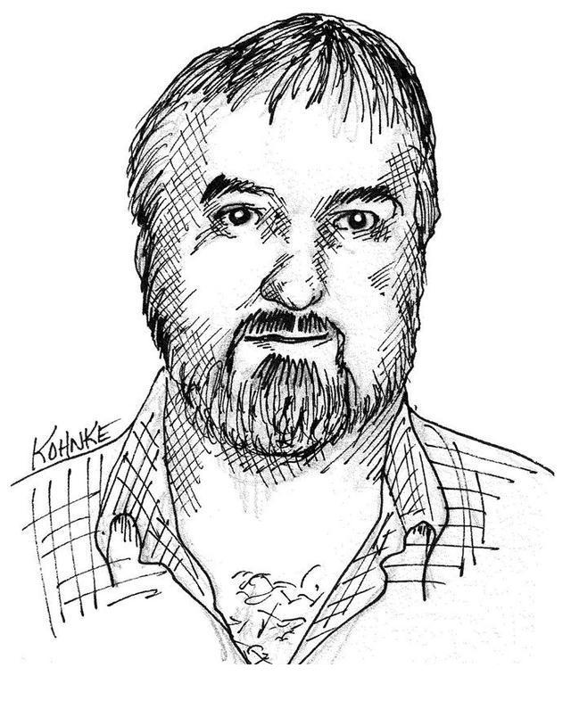
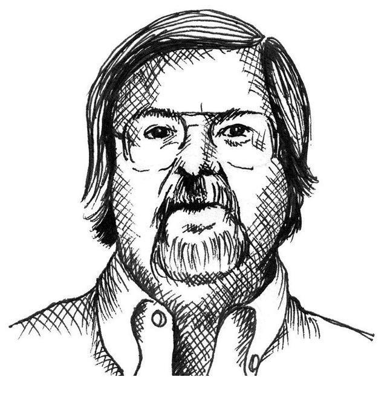
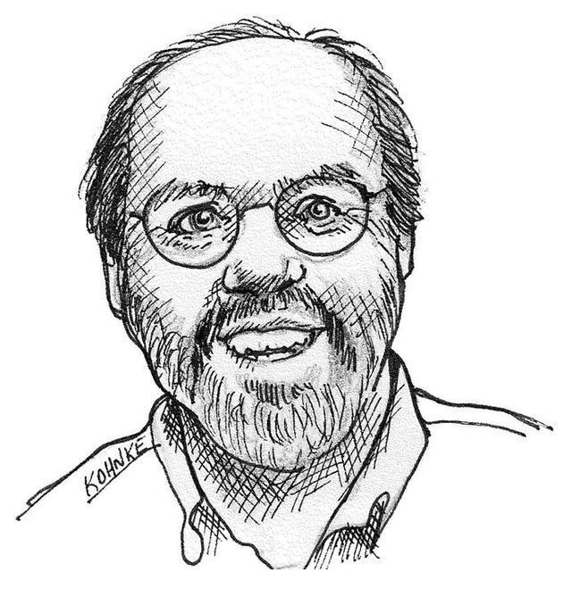

有多少程序员，就有多少定义。所以我只询问了一些非常知名且经验丰富的程序员。

Bjarne Stroustrup，C++语言发明者，C++ Programming Language（中译版《C++程序设计语言》）一书作者。

我喜欢优雅和高效的代码。代码逻辑应当直截了当，叫缺陷难以隐藏；尽量减少依赖关系，使之便于维护；依据某种分层战略完善错误处理代码；性能调至最优，省得引诱别人做没规矩的优化，搞出一堆混乱来。整洁的代码只做好一件事。

Bjarne用了“优雅”一词。说得好！我MacBook上的词典提供了如下定义：外表或举止上令人愉悦的优美和雅观；令人愉悦的精致和简单。注意对“愉悦”一词的强调。Bjarne显然认为整洁的代码读起来令人愉悦。读这种代码，就像见到手工精美的音乐盒或者设计精良的汽车一般，让你会心一笑。

Bjarne也提到效率——而且两次提及。这话出自C++发明者之口，或许并不出奇；不过我认为并非是在单纯追求速度。被浪费掉的运算周期并不雅观，并不令人愉悦。留意Bjarne怎么描述那种不雅观的结果。他用了“引诱”这个词。诚哉斯言。糟糕的代码引发混乱！别人修改糟糕的代码时，往往会越改越烂。

务实的Dave Thomas和Andy Hunt从另一角度阐述了这种情况。他们提到破窗理论4。窗户破损了的建筑让人觉得似乎无人照管。于是别人也再不关心。他们放任窗户继续破损。最终自己也参加破坏活动，在外墙上涂鸦，任垃圾堆积。一扇破损的窗户开辟了大厦走向倾颓的道路。

Bjarne也提到完善错误处理代码。往深处说就是在细节上花心思。敷衍了事的错误处理代码只是程序员忽视细节的一种表现。此外还有内存泄漏，还有竞态条件代码。还有前后不一致的命名方式。结果就是凸现出整洁代码对细节的重视。

Bjarne以“整洁的代码只做好一件事”结束论断。毋庸置疑，软件设计的许多原则最终都会归结为这句警语。有那么多人发表过类似的言论。糟糕的代码想做太多事，它意图混乱、目的含混。整洁的代码力求集中。每个函数、每个类和每个模块都全神贯注于一事，完全不受四周细节的干扰和污染。

Grady Booch，Object Oriented Analysis and Design with Applications（中译版《面向对象分析与设计》）一书作者。

整洁的代码简单直接。整洁的代码如同优美的散文。整洁的代码从不隐藏设计者的意图，充满了干净利落的抽象和直截了当的控制语句。

Grady的观点与Bjarne的观点有类似之处，但他从可读性的角度来定义。我特别喜欢“整洁的代码如同优美的散文”这种看法。想想你读过的某本好书。回忆一下，那些文字是如何在脑中形成影像！就像是看了场电影，对吧？还不止！你还看到那些人物，听到那些声音，体验到那些喜怒哀乐。

阅读整洁的代码和阅读Lord of the Rings（中译版《指环王》）自然不同。不过，仍有可类比之处。如同一本好的小说般，整洁的代码应当明确地展现出要解决问题的张力。它应当将这种张力推至高潮，以某种显而易见的方案解决问题和张力，使读者发出“啊哈！本当如此！”的感叹。

窃以为Grady所谓“干净利落的抽象”（crisp abstraction），乃是绝妙的矛盾修辞法。毕竟crisp几乎就是“具体”（concrete）的同义词。我MacBook上的词典这样定义crisp一词：果断决绝，就事论事，没有犹豫或不必要的细节。尽管有两种不同的定义，该词还是承载了有力的信息。代码应当讲述事实，不引人猜测。它只该包含必需之物。读者应当感受到我们的果断决绝。

“老大”Dave Thomas，OTI公司创始人，Eclipse战略教父

整洁的代码应可由作者之外的开发者阅读和增补。它应当有单元测试和验收测试。它使用有意义的命名。它只提供一种而非多种做一件事的途径。它只有尽量少的依赖关系，而且要明确地定义和提供清晰、尽量少的API。代码应通过其字面表达含义，因为不同的语言导致并非所有必需信息均可通过代码自身清晰表达。

Dave老大在可读性上和Grady持相同观点，但有一个重要的不同之处。Dave断言，整洁的代码便于其他人加以增补。这看似显而易见，但亦不可过分强调。毕竟易读的代码和易修改的代码之间还是有区别的。

Dave将整洁系于测试之上！要在十年之前，这会让人大跌眼镜。但测试驱动开发（Test Driven Development）已在行业中造成了深远影响，成为基础规程之一。Dave说得对。没有测试的代码不干净。不管它有多优雅，不管有多可读、多易理解，微乎测试，其不洁亦可知也。

Dave两次提及“尽量少”。显然，他推崇小块的代码。实际上，从有软件起人们就在反复强调这一点。越小越好。

Dave也提到，代码应在字面上表达其含义。这一观点源自Knuth的“字面编程”（literate programming）5。结论就是应当用人类可读的方式来写代码。

Michael Feathers，Working Effectively with Legacy Code（中译版《修改代码的艺术》）一书作者。

我可以列出我留意到的整洁代码的所有特点，但其中有一条是根本性的。整洁的代码总是看起来像是某位特别在意它的人写的。几乎没有改进的余地。代码作者什么都想到了，如果你企图改进它，总会回到原点，赞叹某人留给你的代码——全心投入的某人留下的代码。

一言以蔽之：在意。这就是本书的题旨所在。或许该加个副标题，如何在意代码。

Michael一针见血。整洁代码就是作者着力照料的代码。有人曾花时间让它保持简单有序。他们适当地关注到了细节。他们在意过。

Ron Jeffries，Extreme Programming Installed（中译版《极限编程实施》）以及Extreme Programming Adventures in C#（中译版《C#极限编程探险》）作者。

Ron初入行就在战略空军司令部（Strategic Air Command）编写Fortran程序，此后几乎在每种机器上编写过每种语言的代码。他的言论值得咀嚼。

近年来，我开始研究贝克的简单代码规则，差不多也都琢磨透了。简单代码，依其重要顺序：

能通过所有测试；

没有重复代码；

体现系统中的全部设计理念；

包括尽量少的实体，比如类、方法、函数等。

在以上诸项中，我最在意代码重复。如果同一段代码反复出现，就表示某种想法未在代码中得到良好的体现。我尽力去找出到底那是什么，然后再尽力更清晰地表达出来。

在我看来，有意义的命名是体现表达力的一种方式，我往往会修改好几次才会定下名字来。借助Eclipse这样的现代编码工具，重命名代价极低，所以我无所顾忌。然而，表达力还不只体现在命名上。我也会检查对象或方法是否想做的事太多。如果对象功能太多，最好是切分为两个或多个对象。如果方法功能太多，我总是使用抽取手段（Extract Method）重构之，从而得到一个能较为清晰地说明自身功能的方法，以及另外数个说明如何实现这些功能的方法。

消除重复和提高表达力让我在整洁代码方面获益良多，只要铭记这两点，改进脏代码时就会大有不同。不过，我时常关注的另一规则就不太好解释了。

这么多年下来，我发现所有程序都由极为相似的元素构成。例如“在集合中查找某物”。不管是雇员记录数据库还是名-值对哈希表，或者某类条目的数组，我们都会发现自己想要从集合中找到某一特定条目。一旦出现这种情况，我通常会把实现手段封装到更抽象的方法或类中。这样做好处多多。

可以先用某种简单的手段，比如哈希表来实现这一功能，由于对搜索功能的引用指向了我那个小小的抽象，就能随需应变，修改实现手段。这样就既能快速前进，又能为未来的修改预留余地。

另外，该集合抽象常常提醒我留意“真正”在发生的事，避免随意实现集合行为，因为我真正需要的不过是某种简单的查找手段。

减少重复代码，提高表达力，提早构建简单抽象。这就是我写整洁代码的方法。

Ron以寥寥数段文字概括了本书的全部内容。不要重复代码，只做一件事，表达力，小规模抽象。该有的都有了。

Ward Cunningham，Wiki发明者，eXtreme Programming（极限编程）的创始人之一，Smalltalk语言和面向对象的思想领袖。所有在意代码者的教父。

如果每个例程都让你感到深合己意，那就是整洁代码。如果代码让编程语言看起来像是专为解决那个问题而存在，就可以称之为漂亮的代码。

这种说法很Ward。它教你听了之后就点头，然后继续听下去。如此在理，如此浅显，绝不故作高深。你大概以为此言深合己意吧。再走近点看看。

“……深合己意”。你最近一次看到深合己意的模块是什么时候？模块多半都繁复难解吧？难道没有触犯规则吗？你不是也曾挣扎着想抓住些从整个系统中散落而出的线索，编织进你在读的那个模块吗？你最近一次读到某段代码、并且如同对Ward的说法点头一般对这段代码点头，是什么时候的事了？

Ward期望你不会为整洁代码所震惊。你无需花太多力气。那代码就是深合你意。它明确、简单、有力。每个模块都为下一个模块做好准备。每个模块都告诉你下一个模块会是怎样的。整洁的程序好到你根本不会注意到它。设计者把它做得像一切其他设计般简单。

那Ward有关“美”的说法又如何呢？我们都曾面临语言不是为要解决的问题所设计的困境。但Ward的说法又把球踢回我们这边。他说，漂亮的代码让编程语言像是专为解决那个问题而存在！所以，让语言变得简单的责任就在我们身上了！当心，语言是冥顽不化的！是程序员让语言显得简单。