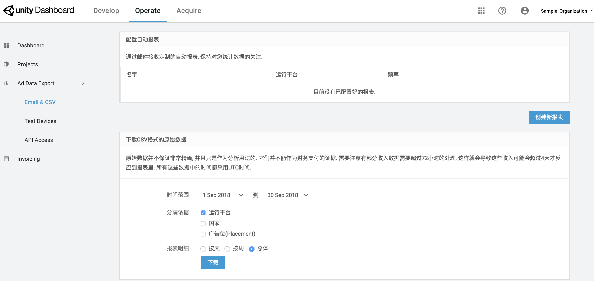
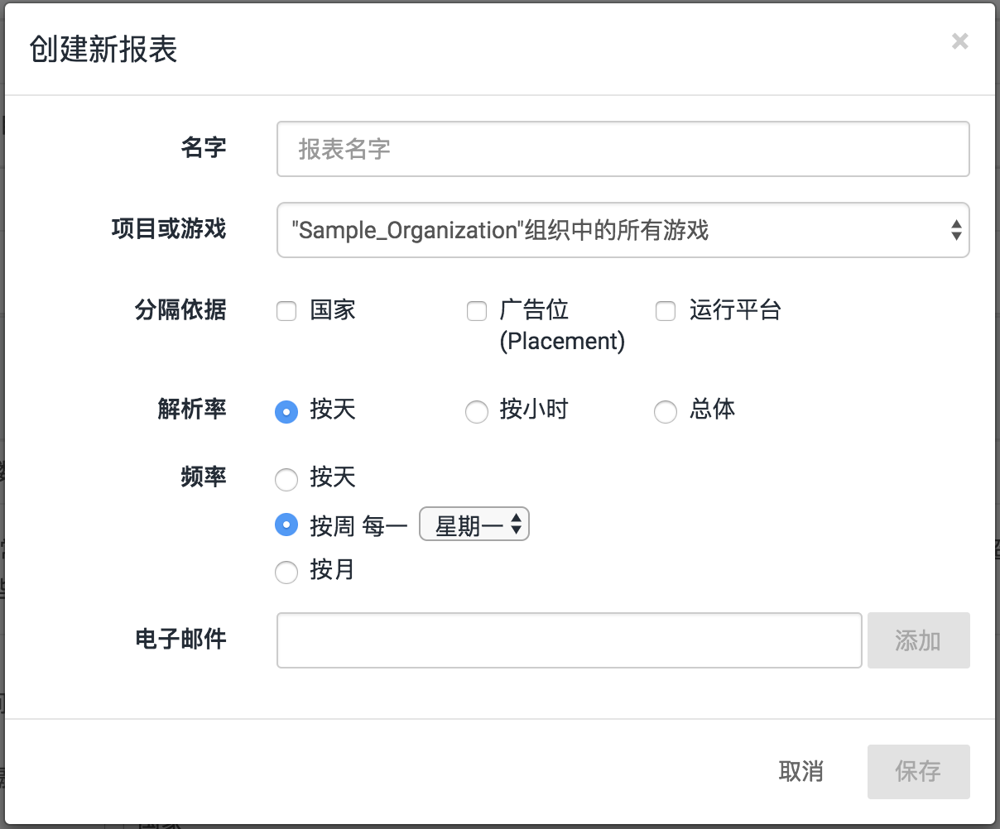
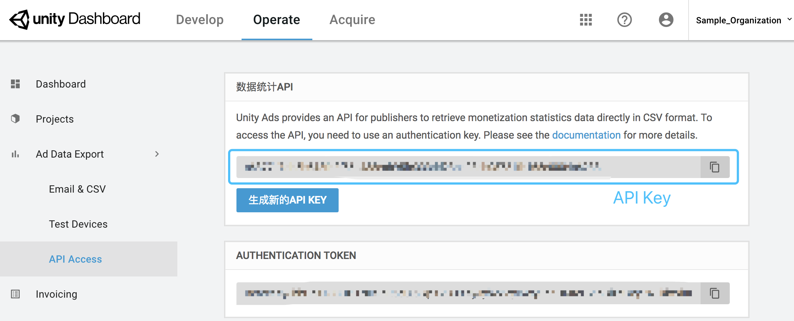

# 变现数据分析

## 介绍

Unity Ads 提供了强大的数据报表工具以帮助您分析您的游戏变现表现。您可以使用如下三种方式获取广告数据：

- 在Unity Ads 后台下载 [CSV格式的原始数据](https://github.com/unity-cn/unityads-help-cn/wiki/MonetizationStatistics#raw-CSV-data)
- 在Unity Ads 后台配置 [自动发送数据报表](https://github.com/unity-cn/unityads-help-cn/wiki/MonetizationStatistics#auto-report)
- 使用 [变现统计API](https://github.com/unity-cn/unityads-help-cn/wiki/MonetizationStatistics#stats-api) 获取数据


## 下载CSV原始数据

如需下载组织 Organization 的CSV格式广告数据：

1. 访问 [Unity Ads后台](https://operate.dashboard.unity3d.com/) > **Ad Data Export** > **Email & SCV** 。

2. 在页面下方的

   下载CSV格式的原始数据

   中配置报表:

   - 时间范围
   - 分割依据 （运行平台，国家，广告位）
   - 报表明细 （天，周，总体）

3. 点击**下载**生成报表。




## 配置自动发送报表

如需定期自动发送广告数据：

1. 访问 [Unity Ads后台](https://operate.dashboard.unity3d.com/) > **Ad Data Export** > **Email & SCV** 。
2. 点击**创建新报表**。
3. 在弹出的窗口中配置报表:
   - 名字
   - 项目或游戏
   - 分隔依据 （运行平台，国家，广告位）
   - 解析率 （天，小时，总体）
   - 频率 （天，周，月）
   - 电子邮件 （支持多个接收人，用英文逗号`,`分隔开）
4. 点击**保存**。




## 变现统计API

开发者可以使用 变现统计API 通过**程序化**的方式直接拉取CSV格式广告数据，这些数据和在 [Unity Ads后台](https://operate.dashboard.unity3d.com/)广告报表中使用的数据相同，一般为有自己报表系统的开发者所采用。

使用统计API分2个阶段:

1. 用户发起一个 **GET** 请求到验证服务器, 验证通过后服务器会返回一个302 重定向消息，消息里会包含访问统计服务器的最终链接.
2. 用户发起一个 **GET** 请求到统计服务器链接, 统计服务器在返回消息的 **body** 中包含用户请求的CSV格式数据.

### 验证

使用 统计API 需要 API Key, 可以在开发者后台找到：

1. 访问 [Unity Ads后台](https://operate.dashboard.unity3d.com/) > **Ad Data Export** > **API Access** 。
2. 复制**数据统计API**下的API key。



您必须要在验证**GET**请求中使用`apikey`参数传入API key.

成功完成验证后, 服务器会返回一个`HTTP 302`重定向消息，消息的 `Location` HTTP Header里包含了统计数据的目标地址.

跳转重定向URL则可以获取广告数据，普遍的HTTP client都支持这个标准的HTTP请求行为。例如，在控制台输入如下命令可以直接请求到广告数据：

```
curl -L "https://gameads-admin.applifier.com/stats/monetization-api?apikey=APIKEY"
```

访问统计服务器，您必须使用一个合法的URL签名。如果签名验证失败, 统计服务器会返回一个 `HTTP/1.1 200 OK` header 和 body包含如下报错内容的信息：

```
{"error":"Authentication error","responseCode":500,"status":"error"}
```

### 请求格式

变现统计API 请求格式如下:

```
http://gameads-admin.applifier.com/stats/monetization-api?apikey=<apikey>&fields=<fields>[&splitBy=<splitbyfields>][&scale=<scale>][&start=<startDate>][&end=<endDate>][&sourceIds=<sourceIds>]
```

举个例子：

```
curl -L "https://gameads-admin.applifier.com/stats/monetization-api?apikey=a0db655ac99b68cb4d1835e878e06473277dd061782dbeec813cb3b14cb723ee&splitBy=zone,country&fields=adrequests,available,views,revenue&start=2016-01-01&end=2016-10-01&scale=day&sourceIds=1003843" > ~/Desktop/UnityAdsMonetization.csv
```

### 请求参数

变现统计API 各项请求参数的描述如下:

| 请求参数 | 参数描述                                                     |
| -------- | ------------------------------------------------------------ |
| ``       | 从开发者后台获取的 [API Key](https://github.com/unity-cn/unityads-help-cn/wiki/MonetizationStatistics#api-key) |
| ``       | 广告数据报表的列，参数值以英文逗号`,`分隔  * `adrequests` * `available` * `started` * `views` * `revenue` * `platform` * `all`  **提示：** 如果您不填任何值，``的默认值为`all`。 关于每个值的含义，请参考[Unity Ads变现数据解析](https://github.com/unity-cn/unityads-help-cn/wiki/MonetizationStatistics#ads-metrics)。 |
| ``       | 用于处理广告数据报表的行，参数值以英文逗号`,`分隔  * `source` * `zone` * `country`  **提示：** 如果您不填任何值，``的默认值为`country`，如果您不想要分割数据，请使用 `splitbyfields=none`。 `source`代表按游戏；`zone`代表按广告位。 |
| ``       | 按时间分割数据。 每天以 00:00 UTC 作为分割。  * `hour` * `day` * `week` * `month` * `quarter` * `year` * `all`  **提示：** 如果您不填任何值，``的默认值为`day`; 如果您不需要以时间分割数据，请使用 `all`。 |
| `` 和 `` | 数据开始和结束时间  **提示：** 如果不填写不填任何值，``默认为`-7`，``默认为`0`，即为过去一周。 负数代表当前日期之前的时间(比如 `start=-7` 代表7天前)。 日期使用 **ISO** 格式 `YYYY-MM-DDTHH:mm:ss:sssZ` (比如 `2017-12-17T14:00:00.000Z`)。 开始和结束之间会被进位到下一个整时(比如, `14:00:05.000Z` 会被进位成 `15:00:00.000Z`)。 如果您使用了 `=day`和非午夜0点的 `` & `` ，则数据报表仍可能会以小时而不是天显示数据. |
| ``       | 用于筛选数据，参数值为 Unity Game ID，使用英文逗号`,`分隔参数值  **提示：** 如果您不填任何值，默认会返回组织下所有项目的广告数据。指定 Unity Game ID可以只获取该游戏该平台的广告数据。(比如 `sourceIds=1003843`) |

**注意：**
使用多个维度分割数据会导致CSV数据文件过大，如果服务器无法在60秒内完成数据处理，就会因为请求超时而失败。因此，我们建议您根据需要合理选取分割维度。

如果有任何关于数据分析API的其他疑问，请联系[Unity Ads支持](https://github.com/unity-cn/unityads-help-cn/wiki/unityads-support@unity3d.com)。


## Unity Ads变现数据解析

### # 广告术语

#### Ad request

游戏客户端在SDK初始化阶段向Unity Ads服务器发送**广告请求（Ad request）**。如果服务器存在**可用广告（available）**，则下发给客户端，客户端缓存广告等待被展示。当玩家观看广告时，游戏客户端会请求新广告。

#### Available

收到广告请求时，Unity Ads服务器成功返回一个**可用广告（available）**。

#### Ad start = Impression

当广告开始播放即为一次**ad start**，也就是通常所说的**广告展示（Impression）**。游戏中广告展示的数量和质量将会决定您的广告收益，请参考[数据分析](https://github.com/unity-cn/unityads-help-cn/wiki/MonetizationStatistics#interpret-data)部分。

#### Views（播放完毕）

玩家完整观看完广告会记为一次view。

#### Fill rate（填充率）

**Fill rate** = **Available** / **Ad request**。Unity Ads的平均填充率通常在95%以上，但某些因素如地域和玩家行为可能会影响填充率。

#### eCPM (Effective Cost per Mile)

**eCPM**是指千次广告展示所产生的平均广告收益。该值取决于游戏所展示广告的价格和表现，您可以将 eCPM 作为广告主衡量您游戏广告位价值的参考依据。

------


### # 数据分析

下面介绍一些数据报表中的现象及其出现的可能原因。

#### 有广告请求 ad requests 却没有广告展示 ad starts

使用测试模式 Test Mode 是可能的原因，请检查您是否禁用了测试模式。

#### eCPM过低

eCPM反映了您游戏内广告展示的数量和质量，您需要考虑优化广告设计及营销策略来提高eCPM。下面列出了玩家与广告交互的常见方式，数字越大代表广告表现越好，收入潜力也就越高：

1. 观看广告（玩家触发了一个广告播放）
2. 完整观看广告（玩家看完了整个广告视频）
3. 点击（玩家点击广告并跳转至下载页面）
4. 安装（玩家下载并安装广告中的应用）

请您在策划变现策略时参考这点，我们推荐您参考[视频广告设计指南](https://github.com/unity-cn/unityads-help-cn/wiki/Unity视频广告设计指南)了解更多广告设计案例。

#### 广告展示/广告请求(Impressions/Ad requests)比率过低

广告展示/广告请求比率过低说明 Unity SDK 初始化过于频繁，初始化次数超过了广告实际被游戏玩家观看的次数。SDK初始化时会请求一次广告，记一个ad request，请求成功后会缓存广告等待被展示。 如果这些广告没有机会被展示，您可以尝试参考以下方式调整广告设计：

- 将广告位设计得更加明显，更容易被玩家注意到
- 为玩家提供更具吸引力的游戏内奖励

请参考[视频广告设计指南](https://github.com/unity-cn/unityads-help-cn/wiki/Unity视频广告设计指南)了解更多广告设计案例。

#### 数据报告为空（没有ad requests、starts及views）

请检查[广告后台](https://operate.dashboard.unity3d.com/)的广告服务状态为开启，并且您在初始化 Unity Ads 时使用了正确的 Unity Game ID。

###  Pages 57

## [Home](https://github.com/unity-cn/unityads-help-cn/wiki/Home)

## 置顶

- [Unity Ads与GDPR](https://github.com/unity-cn/unityads-help-cn/wiki/gdpr)
- [流量变现常见问题(中文FAQ)](https://github.com/unity-cn/unityads-help-cn/wiki/monetization)
- [《基本操作与集成手册》](https://github.com/unity-cn/unityads-help-cn/blob/master/Unity Ads Integration Manual.pdf)
- [《Unity Ads 开发者后台操作手册》](https://github.com/unity-cn/unityads-help-cn/blob/master/Unity Ads Operate Dashboard Manual.pdf)
- [开发者合同下载](https://share.unity.com/receive/?thread=6VCS-3MAW&packageCode=NBDG5ztN64jvvtm9eRlXZaZXvanNjXbSIaK8ahKVXls#keyCode=LKVscTnlAyR6YU7gW3zT1j5xE-CIpdTeQkRzhZsw410)

## 头条

- 2019.07.19, 添加了[COPPA设置及其影响](https://github.com/unity-cn/unityads-help-cn/wiki/coppa)
- 2019.07.10, 添加了[Unity中app-ads.txt设置指南](https://github.com/unity-cn/unityads-help-cn/wiki/app-ads-txt-guide)
- 2019.07.04, 更新了[《Unity Ads 开发者后台操作完全手册》](https://github.com/unity-cn/unityads-help-cn/blob/master/Unity Ads Operate Dashboard Manual.pdf)
- 2019.07.04, 更新了[《基本操作与集成手册》](https://github.com/unity-cn/unityads-help-cn/blob/master/Unity Ads Integration Manual.pdf)
- 2019.03.28, 更新[提款流程](https://github.com/unity-cn/unityads-help-cn/wiki/RevenueAndPayment)文档
- 2018.09.30, 增加了[应用被Google Play下架处理办法](https://github.com/unity-cn/unityads-help-cn/wiki/PrivacyPolicyforGooglePlay)
- 2018.09.29, 增加了[黑屏广告处理办法](https://github.com/unity-cn/unityads-help-cn/wiki/black-screen-steps)
- 2018.09.14, 更新了[《Unity Ads 开发者后台操作完全手册》](https://github.com/unity-cn/unityads-help-cn/blob/master/Unity Ads Operate Dashboard Manual.pdf)
- 2018.09.12, 更新了[《基本操作与集成手册》](https://github.com/unity-cn/unityads-help-cn/blob/master/Unity Ads Integration Manual.pdf)
- 2018.06.01, 更新[提款流程](https://github.com/unity-cn/unityads-help-cn/wiki/RevenueAndPayment)文档，Unity Ads现在支持自动付款。
- 2018.05.29, 新增关于GDPR的文档[Unity Ads与GDPR](https://github.com/unity-cn/unityads-help-cn/wiki/gdpr)
- 2018.02.28, 新增[变现盈利与提款流程](https://github.com/unity-cn/unityads-help-cn/wiki/RevenueAndPayment)。
- 2018.02.28, 新增[变现与统计数据分析](https://github.com/unity-cn/unityads-help-cn/wiki/MonetizationStatistics)。
- 2018.02.13, 新增[广告位与广告过滤说明文档](https://github.com/unity-cn/unityads-help-cn/wiki/PlacementsAndFilters)。
- 2018.02.13, 新增简单版后台操作手册[Unity Ads后台简介](https://github.com/unity-cn/unityads-help-cn/wiki/DashboardGuide)。
- 2017.11.17, Unity Ads 流量变现指南新增[移动视频广告白皮书](https://github.com/unity-cn/unityads-help-cn/blob/master/Unity Ad Whitepaper CN.pdf)
- 2017.11.16, 更新了[《基本操作与集成手册》](https://oc.unity3d.com/index.php/s/givVc2BgC1GiJIk)
- 2017.11.16, Unity Ads 流量变现指南新增[奖励性视频广告最佳实践](https://github.com/unity-cn/unityads-help-cn/blob/master/Best Practice.pdf)
- 2017.11.10, Unity Ads 流量变现指南新增[Unity视频广告设计指南](https://github.com/unity-cn/unityads-help-cn/wiki/Unity视频广告设计指南)
- 2017.11.9, [Unity Ads开发者后台操作手册](https://oc.unity3d.com/index.php/s/5V9GATHdLeG33IU)更新
- 2017.7.04, FAQ中所下载的invoice模板, 增加了中文注释.
- 2016.12.20, [Unity Ads 开发者后台操作完全手册
- 2016.12.14, [Unity Ads 开发者手册](https://oc.unity3d.com/index.php/s/zvY8AL2lcx0W75S)更新至2.0.
- 2016.11.11, [Unity Ads 开发者控制台](http://dashboard.unityads.unity3d.com/)增加了对简体中文的支持.
- 2016.08.18, Unity Ads SDK 2.0 正式版版已经发布了!
- 2016.08.11, [Unity Ads 中文信息站](https://unityadscn.com/)上线了. 用于发布最新通知和博文!
- 2016.08.10, [FAQ](https://github.com/unity-cn/unityads-help-cn/wiki/monetization) 中增加了如何添加测试设备
- 2016.08.01, 制作了[有中文注释的银行信息表](https://oc.unity3d.com/index.php/s/jhlYb5k4WckPGbX)
- 2016.07, 发现 Unity 5.3 的 Services window 有的时候 gameid 不更新, 所以使用 5.3 及以前 Services window 的开发者, 不要忘记对照 dashboard 上检查 gameid是否正确.

## Unity Ads 开发者, 流量变现成指导

- [移动视频广告白皮书](https://github.com/unity-cn/unityads-help-cn/blob/master/Unity Ad Whitepaper CN.pdf)
- [视频广告设计指南](https://github.com/unity-cn/unityads-help-cn/wiki/Unity视频广告设计指南)
- [广告位(Placement)的介绍](https://github.com/unity-cn/unityads-help-cn/wiki/placements)
- [统计API](https://github.com/unity-cn/unityads-help-cn/wiki/stats-api)

## Unity Ads 广告主展示广告指导

- [广告主简易手册](https://oc.unity3d.com/index.php/s/oxH6kslKw4ClfQ7)

## 常见问题（FAQ）

- [流量变现相关 FAQ](https://github.com/unity-cn/unityads-help-cn/wiki/monetization)
- [黑屏广告处理办法](https://github.com/unity-cn/unityads-help-cn/wiki/black-screen-steps)

## 其他

- [Unity Developer Network 账号变化](https://github.com/unity-cn/unityads-help-cn/wiki/account-migration-notice)

## 联系方式

- [Privacy policy](http://unity3d.com/legal/privacy-policy)
- [Unity Ads - Terms of Service for Advertisers(广告主)](https://unity3d.com/legal/ads-advertisers-terms-of-service)
- [Unity Ads - Terms of Service for Publishers(开发者)](https://unity3d.com/legal/ads-publishers-terms-of-service)
- [开发者合同下载](https://share.unity.com/receive/?thread=6VCS-3MAW&packageCode=NBDG5ztN64jvvtm9eRlXZaZXvanNjXbSIaK8ahKVXls#keyCode=LKVscTnlAyR6YU7gW3zT1j5xE-CIpdTeQkRzhZsw410)

## 咨询

- [联系方式](https://github.com/unity-cn/unityads-help-cn/wiki/contact)

##### Clone this wiki locally