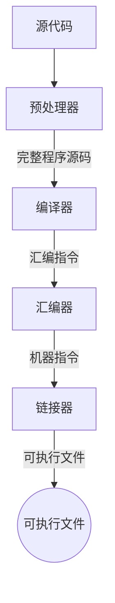
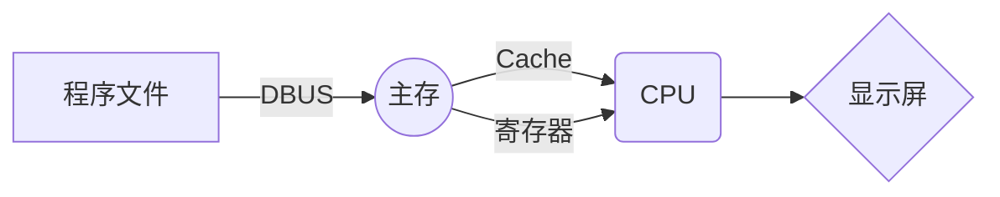
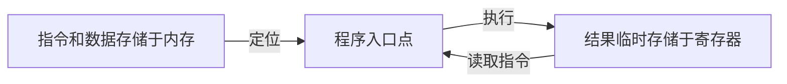
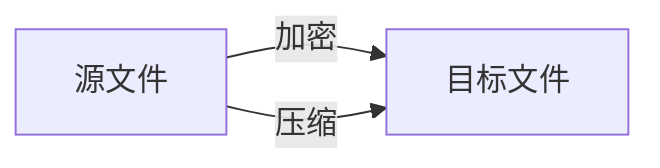
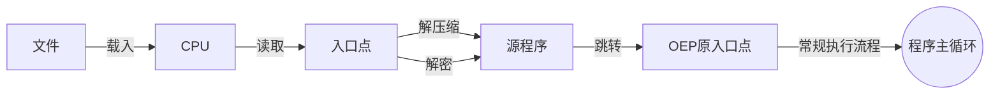

# Unity Android 包破解

常见加密算法：
- 非可逆加密：加密后的数据不能还原成原来的数据，如MD5，SHA1.多用于校验
- 可逆加密：有公钥和私钥，通过公钥加密，私钥解密。常用的有：RSA,AES。多用于敏感数据传输与存储。
- 其他简单算法：异或，移位，混淆等。这些简单算法有时又混合使用。

常规程序制作方式：

当程序制作完成后，会存储于磁盘上，当要运行时，则其传输过程类似：

程序在CPU中的执行流程：

加密方式：加密+压缩

加密后的文件执行：

# 加壳：
壳先于程序运行，再实时解压缩程序，还原整个程序，再将控制权移交给还原后的程序。

壳一般会按程序区块加密，也按区块解密。解密的区块会放在内存中，文件执行时，会进行重定向至内存地址中。

在壳运行整个生命周期，只做这样几件事：可以把壳当作守财奴。
- 运行，做些验证处理。如同守财奴一样，先看看四周安不安全，能不能放财物。
- 动态解密，还原整个真实可执行文件。将财物一个个掏出来，边掏边张望，有没有人跟踪和偷窥。
- 把执行权交给真实的可执行文件。

在Android中，运行App时，先从Application开始，Application是入口，进入之后，可加载so，创建Activity以及其他操作。

加固的APK会劫持Application，调用加固so，执行so中的动态解密操作，得到实际的dex。dex是能被Android虚拟机直接执行的文件。

脱壳的最重要的目的：**还原二进制可执行文件！** 。此操作的实现，只能是**dump 内存块**。

实现方式有2种：
* HOOK关键函数，在APP运行时，调用dump操作。
* 通过内存查找方式（类似CheatEngine）匹配dex文件特征，dump dex内存块。

## Android脱壳
