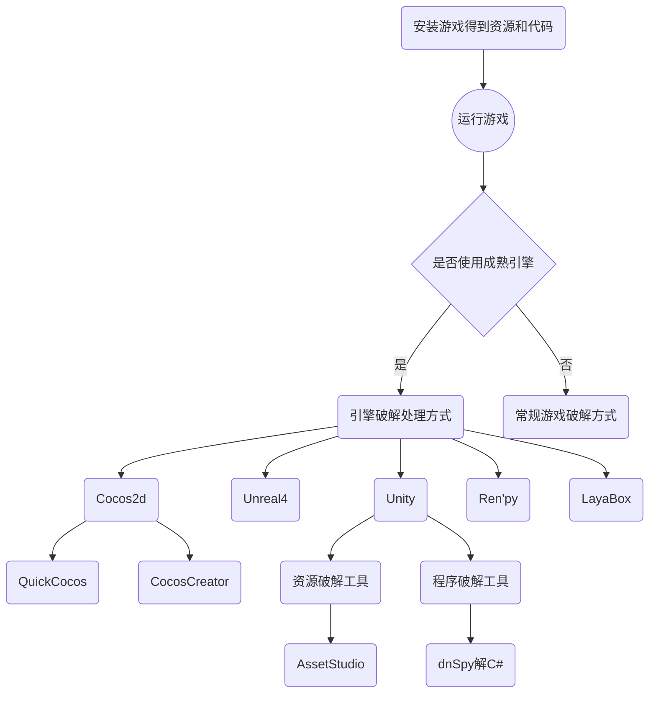

# YOU SHOULD KNOW
- PlayerPrefs存储在注册表`HKEY_CURRENT_USER\Software\[公司名称]\[游戏名称]`中
- Unity生成游戏主逻辑一般放在：libil2cpp.so(il2cpp),Assembly-CSharp.dll(mono.net),lua脚本(xlua)
- Android架构：Arm-v7:常见ARM架构；Arm-v8：新架构；X86：常用于模拟器、PC的Intel架构

# 制作

- 不要拼音和英文混排！不要拼音和英文混排！不要拼音和英文混排！
- 文件名或目录名中间不要有空格！文件名或目录名中间不要有空格！文件名或目录名中间不要有空格！
- 全局对象（跨场景存在）名称可前缀`$`

# 破解
对于游戏制作中，必要的资源类型：

通用资源：不依赖引擎实现
- 2D图片(PNG，JPG等)：UI、2D游戏背景图、
- 2D图片(PNG + Atlas)：序列帧动画，用于2D人物、2D特效
- 音频(Wav,mp3,ogg等)：游戏背景音乐、音效
- 3D模型+模型贴图(fbx,obj等)：静态物体

以及特定资源：依赖引擎
- UI布局（不同引擎，实现不同）
- 3D Animation（不同引擎，实现不同）
- 关卡布局/场景（不同引擎，实现不同）
- 逻辑代码（不同引擎，实现不同）

## 游戏破解流程思路：

总体而言，所有的破解方式与早期的破解形式类似：
1. 对于安装包，可通过解包形式获得完整游戏资源和游戏代码。
    虽然其资源经过加密，但总有解密的地方；其代码是二进制文件（exe、dll），但终归未逃离（可执行文件、动态库）的形式。所以，无论是解资源，还是解代码，都得从代码入手。

2. 得到真实的代码文件。
    对于可执行文件而言(PE,ELF)，可通过辅助工具定位其入口点。对于可执行文件，常见的加密方式是加壳。对于加壳的代码，需要经过脱壳，还原真实的代码文件。
    > 什么是加壳？
    >
    > 可执行程序资源压缩，压缩后的程序可以直接运行。
    >
    > 加壳的全称应该是可执行程序资源压缩，压缩后的程序可以直接运行。
    >
    > 加壳的另一种常用的方式是在二进制的程序中植入一段代码，在运行的时候优先取得程序的控制权，之后再把控制权交还给原始代码，这样做的目的是隐藏程序真正的OEP（入口点，防止被破解）。大多数病毒就是基于此原理。
    >
    > 加壳的程序需要阻止外部程序或软件对加壳程序本身的反汇编分析或者动态分析，以达到保护壳内原始程序以及软件不被外部程序破坏，保证原始程序正常运行。
    >
    > 这种技术也常用来保护软件版权，防止软件被破解。但对于病毒，加壳可以绕过一些杀毒软件的扫描，从而实现它作为病毒的一些入侵或破坏的一些特性。
    >
    > 常利用特殊的算法，对可执行文件里的资源进行压缩，只不过这个压缩之后的文件，可以独立运行，解压过程完全隐蔽，都在内存中完成。它们附加在原程序上通过加载器载入内存后，先于原始程序执行，得到控制权，执行过程中对原始程序进行解密、还原，还原完成后再把控制权交还给原始程序，执行原来的代码部分。加上外壳后，原始程序代码在磁盘文件中一般是以加密后的形式存在的，只在执行时在内存中还原，这样就可以比较有效地防止破解者对程序文件的非法修改，同时也可以防止程序被静态反编译。
    壳，可理解为在程序真实运行之前运行的程序。壳处理原始程序，完全是在内存中。壳不仅仅能压缩可执行程序体积，还可以有其他用途，如提供注册机制、时间限制等等。病毒的一种掩藏方式即是加壳，躲过杀毒软件的识别。

3. 找到入口点
    经过编译的代码，通常以二进制机器码形式存在。机器码可以根据不同的平台架构，反汇编成不同的汇编指令集。
    
    机器码不区分代码和数据，因此反汇编得到的结果，不可能完美还原，这取决于反汇编器（识别机器码的数据和代码）的能力。

    汇编与硬件接近，其操作原始，没有高级语言的流程控制或数据结构，从汇编还原成源码，也不可能完美。这取决于逆向人员（识别汇编与目标源语言一一对应）的能力。

    此时，可通过分析汇编代码，找到代码的入口`Entry`，Entry起提纲契领、抛砖引玉的作用，逻辑的运行，从Entry开始。

    对于代码文件(PE,ELF)或文件，常有文件头，文件头的数据包含了重要信息的偏移量。Entry的偏移量，通常都存于文件头中。

    这一步的关键在于：分析代码文件(PE,ELF)的文件头。

4. 找到对应函数，进行分析，继而修改。
    对于代码文件(PE,ELF)，不仅仅有文件头信息，还包含系统能顺利运行此程序的必要信息：段`Sections`和函数`Subroutines`。

    段通常包含程序中预设的数据：符号`Symbols`、字符串`Strings`、常数`Consts`。

## How To

1. 如何识别引擎：可从目录结构、特殊文件判断。
- Unity: 在游戏目录下搜索`unity`关键字。如`libunity.so`,
    - Android: `assets/bin/Data/Managed`，有`Assembly-CSharp.dll`是mono代码背景；在`lib/arm*/libil2cpp.so`加上`assets\bin\Data\Managed\Metadata\global-metadata.dat`为il2cpp代码背景。
    - Web： 会存在`.unityweb`或`.unity3d`扩展名的文件。注：现阶段Unity的Web常采用WASM技术(WebAssembly)
- Unreal4: 游戏目录通常是：`Engine`和`Binaries`以及`Content`

2. 如何解资源：
对于成熟引擎而言，都有自己的资源格式，但总体而言，会用到*加密*、*压缩*或*加密+压缩*等方式。

Unity常用的资源解包工具为：AssetStudio

## 破解工具