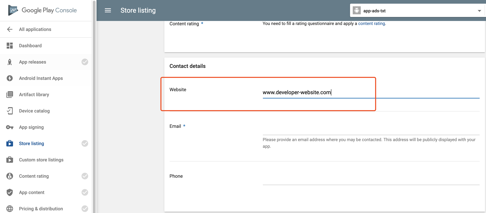

# Unity中app-ads.txt设置指南

随着2017年9月Authorized Digital Sellers specification(Ads.txt)规范的发布，IAB Tech Lab现在已将该规范进一步扩展到APP生态系统，以打击欺诈并对您的创收产生积极影响。Unity是app-ads.txt的坚定支持者。虽然它不能解决移动应用广告交易中的所有违规行为，但它确实创建了一个更健康的生态系统，在整个供应链中具有更大的问责制和透明度。Unity现已支持对app-ads.txt的设置。

### 可以通过两个步骤设置app-ads.txt

#### 步骤1：

应用程序发布者应该确保在应用程序商店中填写的开发者网站（Developer website）字段是最新的。填写后该网站将被用来检索app-ads.txt文件。

- 开发者在应用商店上传应用的时候，应用商店会要求开发者填写开发者的网站信息，既Developer website。

- 如果您没有个人网站，可以借助免费服务生成网页，如：

https://www.wix.com/

http://appreviewdesk.com/index.php?page=sample_websites

#### 步骤2：

应用程序发布者应将名为“app-ads.txt”的文件上传到所填写的网站。将“/app-ads.txt”文件发布在网站的根域和有需要的子域上（仅在特定子域具有不同的广告系统的情况下）。

##### 示例：https://www.xxx.com/app-ads.txt

更多详细关于的详细信息，请参考：https://iabtechlab.com/ads-txt/

### 怎样设置Unity的app-ads.txt？

##### 设置Unity的app-ads.txt需在txt文件中写入如下内容：

###### unity3d.com, 1234567, DIRECT, 96cabb5fbdde37a7

###### adcolony.com, 0a0f72cd66122f31, RESELLER, 1ad675c9de6b5176

###### pokkt.com, 6246, RESELLER, c45702d9311e25fd

###### pubmatic.com, 156520, RESELLER, 5d62403b186f2ace

###### pubmatic.com, 157384, RESELLER, 5d62403b186f2ace

###### spotxchange.com, 117872, RESELLER, 7842df1d2fe2db34

###### spotx.tv, 117872, RESELLER, 7842df1d2fe2db34

###### openx.com, 540871654, RESELLER, 6a698e2ec38604c6

###### rubiconproject.com, 20014, RESELLER, 0bfd66d529a55807

###### rubiconproject.com, 20744, RESELLER, 0bfd66d529a55807

###### reforge.in, 107, RESELLER

###### velismedia.com, 725, RESELLER

###### appnexus.com, 7353, RESELLER

###### xandr.com, 7353, RESELLER

###### telaria.com, rwd19-1234567, RESELLER, 1a4e959a1b50034a

###### tremorhub.com, rwd19-1234567, RESELLER, 1a4e959a1b50034a

###### loopme.com, 9621, RESELLER, 6c8d5f95897a5a3b

##### 字段格式为“URL，Source Developer ID，Relationship Type，Ad Source ID（可选）”，各个字段的含义：

- URL: unity3d.com
- Source Developer ID: 由Unity提供
- Relationship Type: Direct
- [可选] Ad Source ID: 96cabb5fbdde37a7

##### 示例：

比如Develop id为1234567的发布者可以在app-ads.txt文件中写入：

###### unity3d.com, 1234567, DIRECT, 96cabb5fbdde37a7

###### adcolony.com, 0a0f72cd66122f31, RESELLER, 1ad675c9de6b5176

###### pokkt.com, 6246, RESELLER, c45702d9311e25fd

###### pubmatic.com, 156520, RESELLER, 5d62403b186f2ace

###### pubmatic.com, 157384, RESELLER, 5d62403b186f2ace

###### spotxchange.com, 117872, RESELLER, 7842df1d2fe2db34

###### spotx.tv, 117872, RESELLER, 7842df1d2fe2db34

###### openx.com, 540871654, RESELLER, 6a698e2ec38604c6

###### rubiconproject.com, 20014, RESELLER, 0bfd66d529a55807

###### rubiconproject.com, 20744, RESELLER, 0bfd66d529a55807

###### reforge.in, 107, RESELLER

###### velismedia.com, 725, RESELLER

###### appnexus.com, 7353, RESELLER

###### xandr.com, 7353, RESELLER

###### telaria.com, rwd19-1234567, RESELLER, 1a4e959a1b50034a

###### tremorhub.com, rwd19-1234567, RESELLER, 1a4e959a1b50034a

###### loopme.com, 9621, RESELLER, 6c8d5f95897a5a3b

##### 注：

- Developer ID可以在Operate Dashboard上的“Settings” 选项卡下找到
- 如有多个Developer ID，可另取一行填写
- Ad Source ID是由Trustworthy Accountability Group (TAG)认证的Unity特定标识符

更多设置app-ads.txt的内容可以在[App-ads.txt Publisher Advisory](https://iabtechlab.com/wp-content/uploads/2018/11/IABTechLab_-App-ads.txt_publisher_advisory.pdf)中找到。