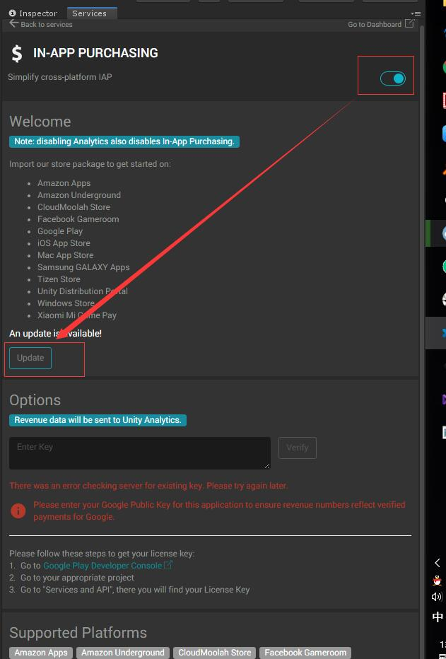
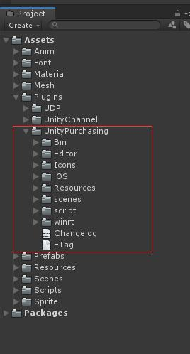

# IAP(In-App Purchasing)内购服务接入

## Unity IAP接入
1. 在Unity编辑器中，Ctrl + 0 打开`Services`服务面板，启用`In-App Purchasing`服务。

2. 在Ctrl+9 打开`Asset Store`搜索`Unity IAP`，下载后导入。导入成功后，会在`Plugins`目录下，存在`UnityPurchasing`目录。或者直接通过服务面板，导入IAP包

3. 针对不同的商店`Google Play Store`或`Apple App Store`，都有其内置的支付接口，需要提供

## Google IAP接入

## Apple Store IAP接入
