Unity服务接入教程
------------

# 准备：

1. 设置项目的名称和公司名称：按下`Ctrl+Shift+B`打开构建设置窗口 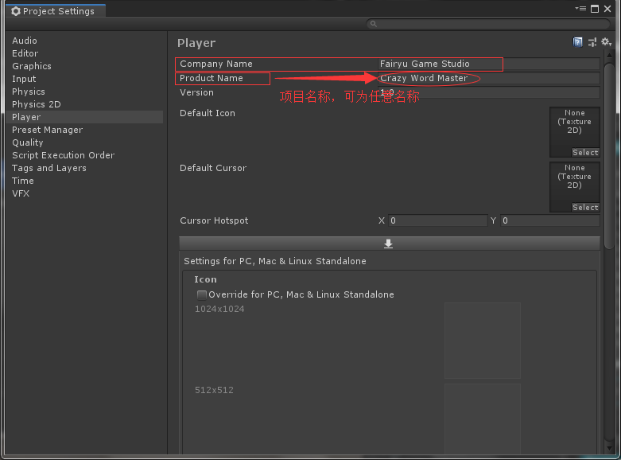
2. 登陆公司统一的Unity 账户（如不知道账户账号密码，查看[项目设置]("file://GAME-DEV/share/TechCentr 研发中心/项目相关/项目设置.md")）。

3. 在Unity中，按下`Ctrl + 0`打开`Services`面板，新建一个Unity Project ID，选择组织名称`Fairyu Game Studio`和项目名称。
   <font color=red>注意：组织名称是固定的。项目名称则要与禅道上的项目名称一致，可为中文。</font>
   
4. 启用Unity服务：在Unity的`Services`面板中，启用`Ads`,`Analytics`,`In-App Purchasing`（如有内购，则开启）等服务。 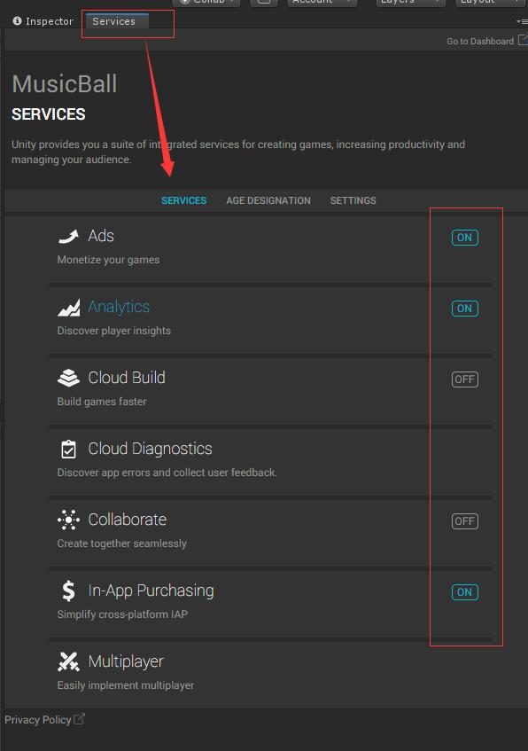

5. 在Unity中，打开`Window - Package Manager`,启用`Advertisement`和`In-App Purchasing`（IAP）包

    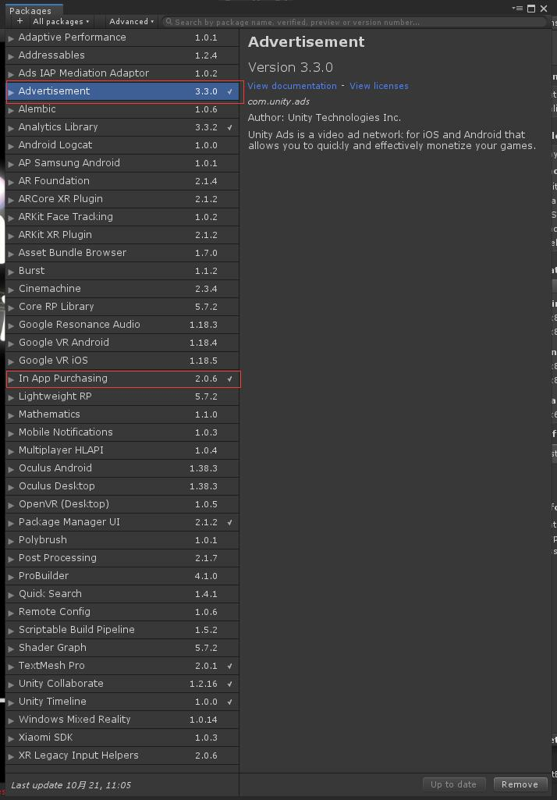

# 广告接入
## 接入Unity Ads广告服务
1. 设置Unity广告的Placement，以便于以不同的形式展现广告：
    1. 打开[Unity开发者面板](https://operate.dashboard.unity3d.com)
    2. 选择当前开发的项目，进入到`Monetization`选项卡中
    3. 选择`Placements`选项。默认会存在`video`和`rewardedVideo`两个placement。
    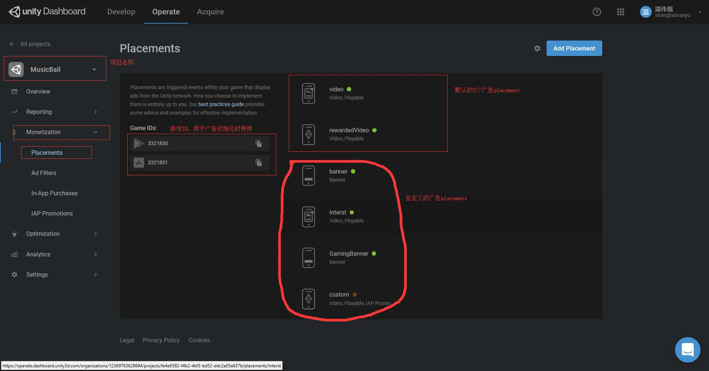

2. 自定义广告placement：点击 `Add Placement`按钮，可打开创建新placement界面。
    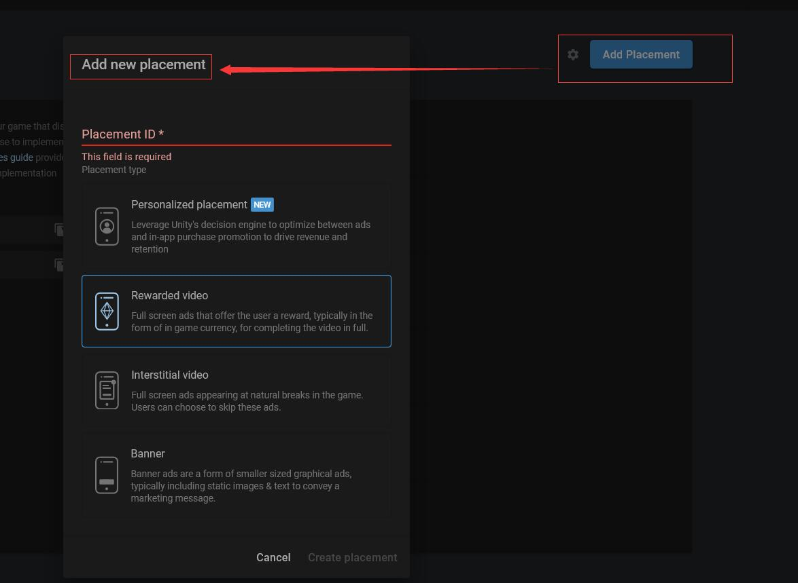

    附录：Unity Placement有4种：
    - Rewarded Video： 激励视频广告，即视频广告，会在游戏中，全界面显示，容易打断玩家游戏感受。
    - Interstitial Video： 插页式视频广告，也是全屏的，用户通常可选择跳过这些广告。
    - Banner ： 横幅广告，常出现在顶上或底下，显示静态图片或文字的广告，不占多少页面。
    - Personalized：自定义广告，除非特别需要，一般不使用。（需要官方的[Monetization](https://assetstore.unity.com/packages/add-ons/services/unity-monetization-3-3-0-66123)包）
    <font color='red'>**注意：**</font>在集成广告时，最好先参考官方的[广告最佳实践指南](https://unityads.unity3d.com/help/resources/best-practices)，在广告变现和游戏体验方面，需要做到折衷平衡。

    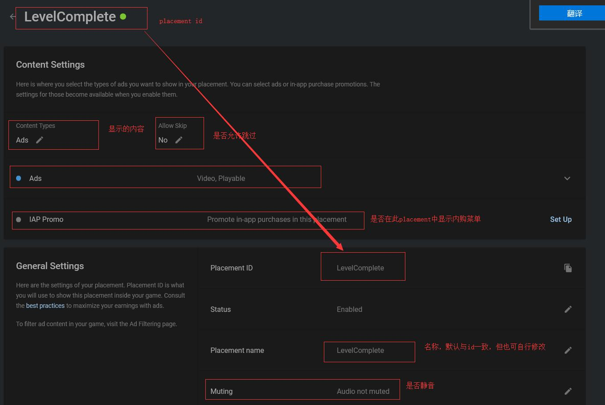

3. 在C#代码中集成广告，主要涉及以下几个步骤：
    1. 初始化广告SDK
    2. 显示广告
    3. 当关闭广告时，如果是激励视频广告，则需要奖励用户
    
    代码示意如下：
    ``` csharp
    // 第一步，初始化广告SDK
    public void InitAdsSDK() {
    #if UNITY_ANDROID
        Advertisement.Initialize(Android平台游戏ID, 测试模式)
    #elif UNITY_IOS
        Advertisement.Initialize(Ios平台游戏ID, 测试模式)
    #endif
    }

    // 第二步，显示广告的placement
    // 在显示之前，需要判断placement是否加载完毕；如果是激励广告，则要判断是否正常显示完毕
    // 激励广告通过`IUnityAdsListener`判断广告的各种状态事件
    public class RewardedAdsExample : MonoBehaviour, IUnityAdsListener { 

        string gameId = "1234567"; // 游戏ID，有Android和IOS两种不同的ID，一定要注意！
        myPlacementId = “rewardedVideo”; // 自定的placement id，如，可是我们自定的LevelComplete
        bool testMode = true; // 是否是测试模式

        // 初始化广告状态侦听器和服务
        void Start () {
            Advertisement.AddListener (this);
            Advertisement.Initialize (gameId, testMode);
        }

        // 实现IUnityAdsListener接口：
        public void OnUnityAdsDidFinish (string placementId, ShowResult showResult) {
            // 定义广告完成时的条件逻辑：
            if (showResult == ShowResult.Finished) {
                // 当用户观看广告结束，应当奖励用户
            } else if (showResult == ShowResult.Skipped) {
                // 当用户跳过观看广告时，则不应奖励用户
            } else if (showResult == ShowResult.Failed) {
                // 广告观看过程中，出现了错误时
                Debug.LogWarning (“The ad did not finish due to an error.);
            }
        }

        // 广告准备好了，可以进行显示
        public void OnUnityAdsReady (string placementId) {
            // 指定的广告placement已经加载完毕，则可正常显示
            if (placementId == myPlacementId) {
                Advertisement.Show (myPlacementId);
            }
        }

        // 广告加载、观看中出现了错误
        public void OnUnityAdsDidError (string message) {
            // 应当记录此错误信息
        }

        public void OnUnityAdsDidStart (string placementId) {
            // 当广告开始播放时，可以做一些处理
        } 
    }

    // 显示Banner 横幅广告时，和显示视频广告不同。
    // 横幅广告通常是自定义的placement，且通过Advertisement.Banner进行控制。
    public class BannerAdsExample: MonoBehaviour {
        void Start {
            Advertisement.Initialize(游戏ID, 测试模式);

            // 设置横幅广告出现的位置，横幅尺寸通常为320 x 50 或 728 x 90
            Advertisement.Banner.SetPosition(BannerPosition.TOP_CENTER); 

            StartCoroutine(ShowBannerWhenReady());
        }

        // 当Banner广告准备好时，再显示
        IEnumerator ShowBannerWhenReady () {
            // 判断有没有准备好，没准备好，则等待0.5秒
            while (!Advertisement.IsReady (横幅广告placementId)) {
                yield return new WaitForSeconds (0.5f);
            }
            // 当准备好后，显示横幅广告
            
            Advertisement.Banner.Show(横幅广告placementId);
        }
    }
    ```

4. 测试广告。在发布游戏之前，需要启用广告服务的`Test Mode`以便于测试。
    1. 在Unity编辑器中，按下`Ctrl+0`打开服务面板，选中`Ads`服务，启用`Test Mode`. 

    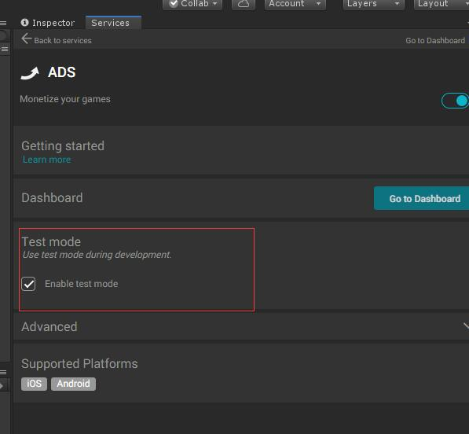

    2. 打开[Unity开发者面板](https://operate.dashboard.unity3d.com/?_ga=2.207882578.1161196246.1571622235-1679056369.1571336478)，选中`Operate`选项卡，并选中当前的项目。

    3. 打开`Settings`的`Project Settings`

    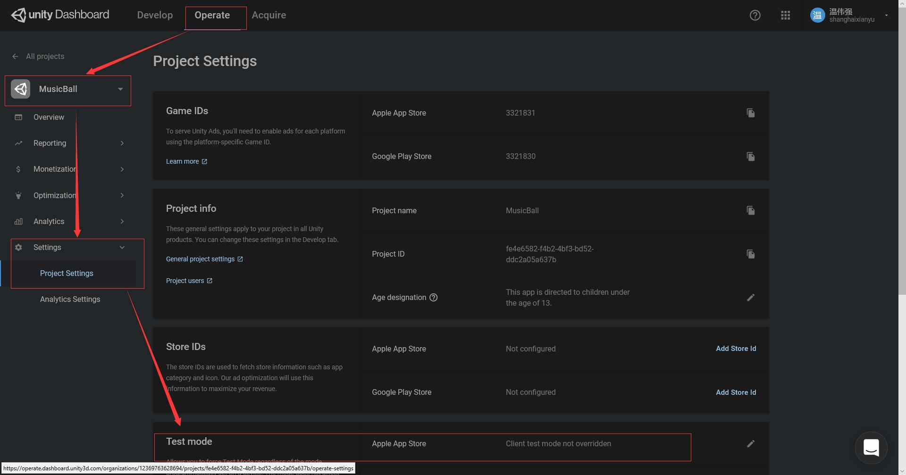

    4. 选中`Test Mode`一项，将`Override client test mode`,改成`Force test mode ON(i.e. use test ads) for all devices`。
    
    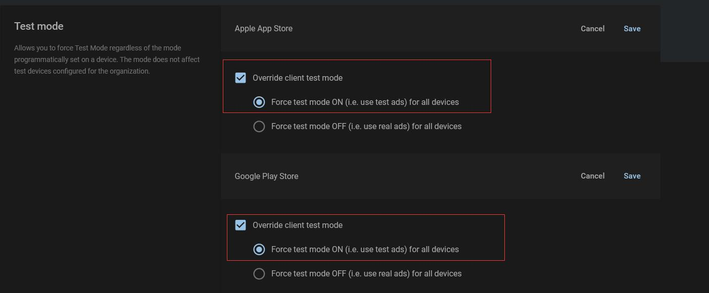

    **<font color=red>记住：在正式发布后，请将Test Mode 关闭！</font>**

    **<font color=red>记住：在正式发布后，请将Test Mode 关闭！</font>**

    **<font color=red>记住：在正式发布后，请将Test Mode 关闭！</font>**

## 接入Google Admob 广告服务
1. 将Google Admob 的Unity Package导入进来：`\\GAME-DEV\share\TechCentr 研发中心\开发库\unity-packages\GoogleMobileAds-v3.18.3.unitypackage`。


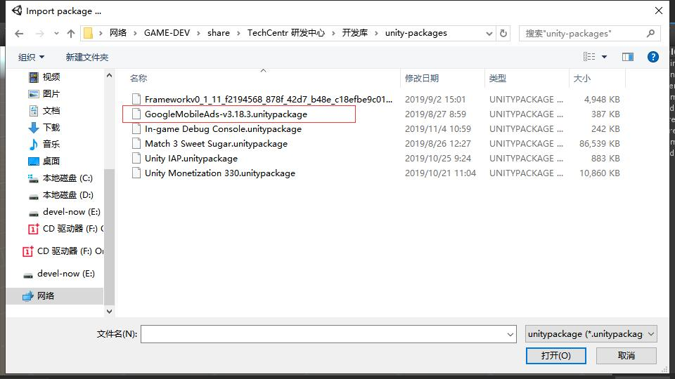

也可以从[admob github](https://github.com/googleads/googleads-mobile-unity/releases)下载最新的Unity包并导入。

2. 注意：系统会在` Assets/GoogleMobileAds/Editor/GoogleMobileAdsDependencies.xml `中列出 Google 移动广告 Unity 插件依赖项,因此，需要解决一下依赖项

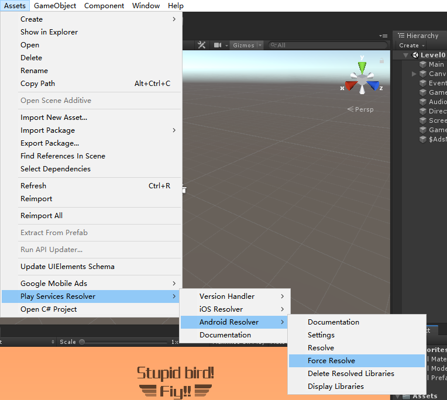


3. 为应用添加广告单元：
    1. 创建广告单元：
    
    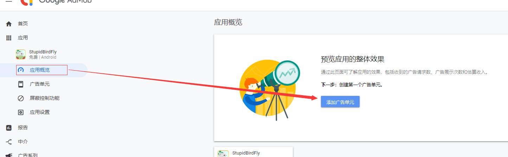
    
    2. 选择广告单元类型：
    
    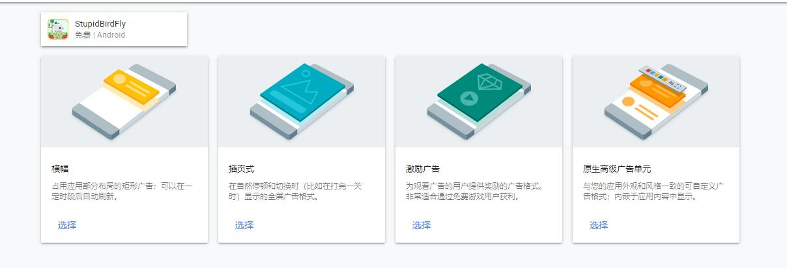
    
    3. 设置广告单元属性：
    
    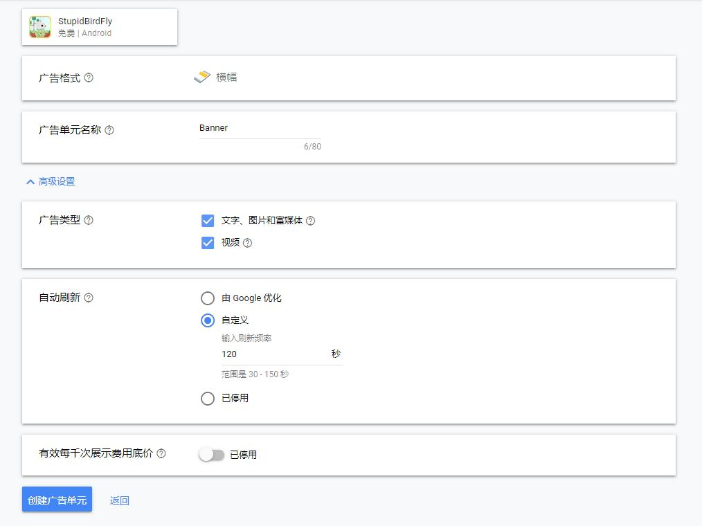
    
    4. 完成广告单元创建：

    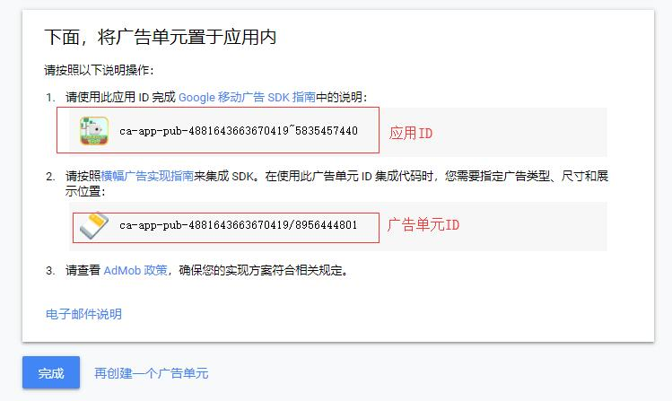


4. 设置Google Admob：

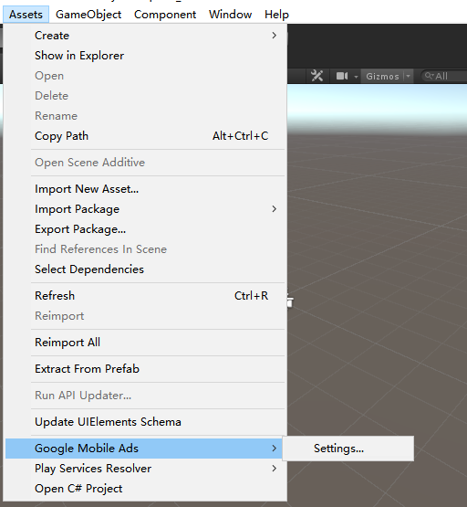

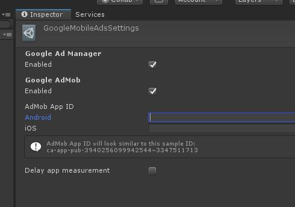

<font color=red>**注意：选中Google Admob 模式，则Admob 的APP ID都需要有值，将其留空会导致崩溃，并显示错误：The Google Mobile Ads SDK was initialized incorrectly。应立即进行此项更改**</font>

**查找应用 ID 和广告单元 ID**

*应用 ID* 是指当应用被添加到 AdMob 中时，系统为其指定的唯一 ID 号。应用 ID 用于识别应用。

*广告单元 ID* 是指当在 AdMob 中创建广告单元时，系统为其指定的唯一 ID 号。广告单元 ID 会被添加到应用代码中，用于识别来自该广告单元的广告请求。

<font color=green>*注意：在创建广告单元的最后一步，需要将应用 ID 以及所有广告单元 ID 复制并粘贴到应用代码中。*</font>
    
要详细了解如何实施，请查阅相应的 Google Developers 入门指南（需翻墙！[Android](https://developers.google.com/admob/android/quick-start) 版、[iOS](https://firebase.google.com/docs/admob/ios/quick-start) 版）。指南中针对横幅广告、插页式广告、激励广告和原生广告分别进行了介绍。
    
要查找并复制应用 ID 和广告单元 ID，请完成以下步骤：

* 查找应用 ID
    1. 访问 https://apps.admob.com 并登录 AdMob 帐号。
    2. 在边栏中点击应用。
    3. 点击所有应用。
    4. 点击应用 ID 列中的 复制 图标复制应用 ID。

    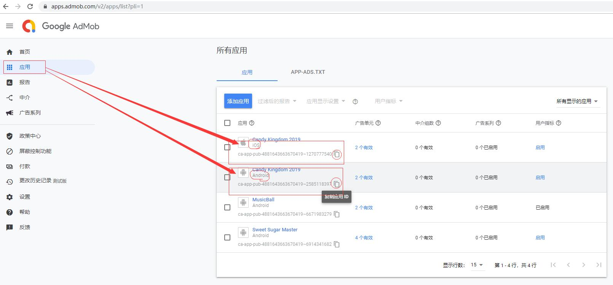

* 查找广告单元 ID
    1. 访问 https://apps.admob.com 并登录 AdMob 帐号。
    2. 在边栏中点击应用。
    3. 点击与广告单元相关联的应用名称。注意：如果没有在最近使用的应用列表中看到该应用，请点击查看所有应用。然后，点击该应用的名称。
    4. 在边栏中点击广告单元。
    5. 点击 广告单元 ID 列中的 复制 图标复制广告单元 ID。

    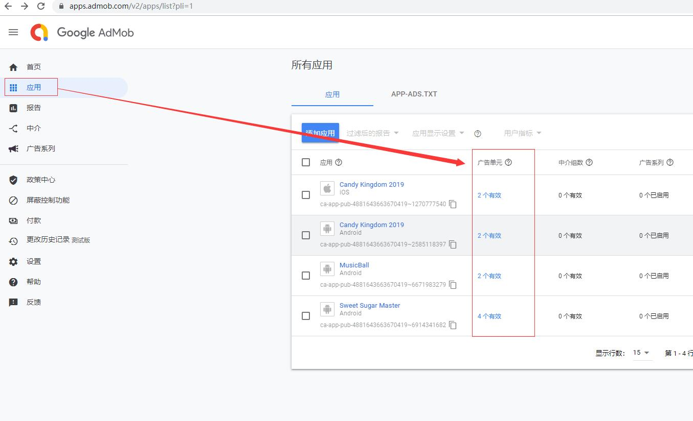

    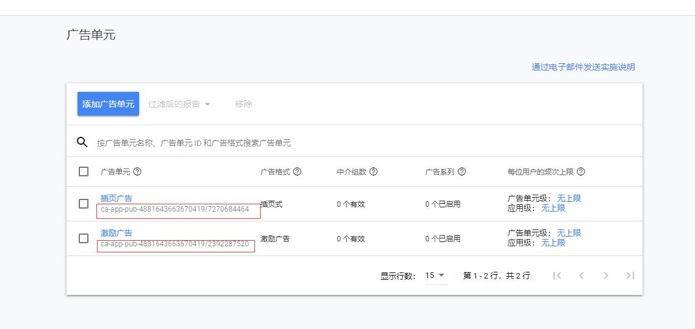
    

5. 初始化MobileAds
    加载广告之前，请先调用 MobileAds.Initialize()，以便让应用初始化移动广告 SDK。此操作仅需执行一次，最好是在应用启动时执行。

    <font color=Gold>警告：在调用 MobileAds.initialize() 时，移动广告 SDK 或中介合作伙伴 SDK 可能会预加载广告。如果需要获得欧洲经济区 (EEA) 用户的同意，请设置任何特定请求的标记（例如 tagForChildDirectedTreatment 或 tag_for_under_age_of_consent），或者在加载广告之前采取其他措施，确保在初始化移动广告 SDK 之前获得用户同意。</font>

    ``` cs

    using GoogleMobileAds.Api;

    public class GoogleMobileAdsDemoScript : MonoBehaviour
    {
        public void Start()
        {
            // Initialize the Google Mobile Ads SDK.
            MobileAds.Initialize(initStatus => { });
        }
    }
    ```

6. 在应用中植入广告：
   
   开始之前：

    <font color=red> **在构建和测试应用时，请确保使用的是测试广告，而不是实际投放的广告。否则，可能会导致您的帐号被暂停。对于 Android 和 iOS 激励广告，加载测试广告最简便的方法就是使用下面的专用测试广告单元 ID：**</font>

    Android: 
    广告格式|	示例广告单元 ID
    --- | ---
    横幅广告	|ca-app-pub-3940256099942544/6300978111
    插页式广告	|ca-app-pub-3940256099942544/1033173712
    激励视频广告|	ca-app-pub-3940256099942544/5224354917
    原生高级广告	|ca-app-pub-3940256099942544/2247696110


    IOS:
    广告格式|	示例广告单元 ID
    --- | ---
    横幅广告	|ca-app-pub-3940256099942544/2934735716
    插页式广告	|ca-app-pub-3940256099942544/4411468910
    激励视频广告|	ca-app-pub-3940256099942544/1712485313
    原生高级广告	|ca-app-pub-3940256099942544/3986624511
    
    <font color=red> **注意：以上示例代码中使用的广告单元ID均是任意值，有些并非测试的广告单元ID，请注意替换**</font>
    
    * 植入横幅广告：横幅广告是在屏幕上占据一处位置的矩形图片或文字广告。这类广告会在用户与应用互动时停留在屏幕上，并且可在一段时间后自动刷新。如果刚开始接触移动广告，建议从横幅广告着手。
        1. 创建BannerView
        ```cs
        
        using GoogleMobileAds.Api;
        
        public class GoogleMobileAdsDemoScript : MonoBehaviour
        {
            private BannerView bannerView;
            
            // …
    
            public void Start()
            {
                #if UNITY_ANDROID
                    string appId = "ca-app-pub-3940256099942544~3347511713"; // Google统一的测试用应用ID，在正式发布中，请改用正式APP ID
                #elif UNITY_IPHONE
                    string appId = "ca-app-pub-3940256099942544~1458002511"; // Google统一的测试用应用ID，在正式发布中，请改用正式APP ID
                #else
                    string appId = "unexpected_platform";
                #endif
    
                // 初始化Google Mobile Ads（Admob) SDK
                MobileAds.Initialize(appId);
    
                this.RequestBanner();
            }
    
            private void RequestBanner()
            {
                #if UNITY_ANDROID
                    string adUnitId = "ca-app-pub-3940256099942544/6300978111";
                #elif UNITY_IPHONE
                    string adUnitId = "ca-app-pub-3940256099942544/2934735716";
                #else
                    string adUnitId = "unexpected_platform";
                #endif
    
                // 在屏幕最上部创建320x50大小的横幅广告
                bannerView = new BannerView(adUnitId, AdSize.Banner, AdPosition.Top);
            }
        }
        ```
        <font color=Gold>请务必注意，根据平台选择使用不同的广告单元。在 iOS 设备上发出广告请求时，需要使用 iOS 广告单元，而在 Android 设备上发出请求时，需要使用 Android 广告单元。</font>
    
        2. 加载广告：此步骤可使用 BannerView 类中的 loadAd() 方法完成。这需要 AdRequest 参数，该参数包含有关单个广告请求的运行时信息（如定位信息）。
        ```cs
        ...
        using GoogleMobileAds.Api;
        ...
        public class GoogleMobileAdsDemoScript : MonoBehaviour
        {
            private BannerView bannerView;
            …
    
            public void Start()
            {
                this.RequestBanner();
            }
    
            private void RequestBanner()
            {
                #if UNITY_ANDROID
                    string adUnitId = "ca-app-pub-3940256099942544/6300978111";
                #elif UNITY_IPHONE
                    string adUnitId = "ca-app-pub-3940256099942544/2934735716";
                #else
                    string adUnitId = "unexpected_platform";
                #endif
    
                // Create a 320x50 banner at the top of the screen.
                bannerView = new BannerView(adUnitId, AdSize.Banner, AdPosition.Top);
    
                // 创建空的广告请求
                AdRequest request = new AdRequest.Builder().Build();
    
                // 请求加载横幅广告
                bannerView.LoadAd(request);
            }
        }
        ```
    
        3. 处理广告事件：要进一步自定义广告行为，可以在广告生命周期内加入许多事件，如加载、打开、关闭等等。可以为相应的 EventHandler 注册代理来监听这些事件，如下所示。
        ``` cs
        
        using GoogleMobileAds.Api;
        
        public class GoogleMobileAdsDemoScript : MonoBehaviour
        {
            private BannerView bannerView;
    
            public void Start()
            {
                this.RequestBanner();
            }
    
            private void RequestBanner()
            {
    
                #if UNITY_ANDROID
                    string adUnitId = "ca-app-pub-3940256099942544/6300978111";
                #elif UNITY_IPHONE
                    string adUnitId = "ca-app-pub-3940256099942544/2934735716";
                #else
                    string adUnitId = "unexpected_platform";
                #endif
    
                bannerView = new BannerView(adUnitId, AdSize.Banner, AdPosition.Top);
    
                // 当广告请求已成功加载时调用
                bannerView.OnAdLoaded += HandleOnAdLoaded;
                // 当广告请求加载失败时调用
                bannerView.OnAdFailedToLoad += HandleOnAdFailedToLoad;
                // 当广告被点击时调用
                bannerView.OnAdOpening += HandleOnAdOpened;
                // 当点击广告后，返回至APP时调用
                bannerView.OnAdClosed += HandleOnAdClosed;
                // 当用户点击广告而离开APP时调用
                bannerView.OnAdLeavingApplication += HandleOnAdLeavingApplication;
    
                // 创建空的广告请求
                AdRequest request = new AdRequest.Builder().Build();
    
                // 加载横幅广告
                bannerView.LoadAd(request);
            }
    
            public void HandleOnAdLoaded(object sender, EventArgs args)
            {
                MonoBehaviour.print("HandleAdLoaded event received");
            }
    
            public void HandleOnAdFailedToLoad(object sender, AdFailedToLoadEventArgs args)
            {
                MonoBehaviour.print("HandleFailedToReceiveAd event received with message: "
                                    + args.Message);
            }
    
            public void HandleOnAdOpened(object sender, EventArgs args)
            {
                MonoBehaviour.print("HandleAdOpened event received");
            }
    
            public void HandleOnAdClosed(object sender, EventArgs args)
            {
                MonoBehaviour.print("HandleAdClosed event received");
            }
    
            public void HandleOnAdLeavingApplication(object sender, EventArgs args)
            {
                MonoBehaviour.print("HandleAdLeavingApplication event received");
            }
        }
        ```
    
        附：广告事件说明

        广告事件|	说明
        ----|----
        OnAdLoaded|	广告加载完成时，系统会执行 OnAdLoaded 事件。
        OnAdFailedToLoad	|广告加载失败时，系统会调用 OnAdFailedToLoad 事件。Message 参数描述发生的故障类型。
        OnAdOpening	|用户点按广告时，系统会调用此方法。如果使用分析产品包跟踪点击，则此方法很适合记录点击。
        OnAdClosed|	用户查看了广告的目标网址并返回应用时，系统会调用此方法。应用可以使用此方法恢复暂停的活动，或执行任何其他必要的操作，以做好互动准备。
        OnAdLeavingApplication	|用户点击打开其他应用（例如，Google Play 商店）时，系统会先调用 onAdOpened，再调用此方法，从而在后台运行当前应用。
    
        支持以下横幅尺寸：
    
        尺寸（宽 x 高）|	说明|	适用范围|	AdSize 常量
        ----        | ----  | ----      | ----
        320x50|	标准横幅|	手机和平板电脑|	BANNER
        320x100	|大型横幅|	手机和平板电脑|	LARGE_BANNER
        300x250|	IAB 中矩形	|手机和平板电脑|	MEDIUM_RECTANGLE
        468x60|	IAB 全尺寸横幅|	平板电脑|	FULL_BANNER
        728x90|	IAB 页首横幅|	平板电脑|	LEADERBOARD
        屏幕宽度 x 32/50/90	|智能横幅|	手机和平板电脑	|SMART_BANNER
    
        <font color=Gold>注意：如果 Android 应用尝试加载的横幅广告超出其布局尺寸，则 SDK 不会展示该横幅广告，而会将一条错误消息写入日志。</font>
    
        当不知道以何种分辨率创建横幅广告时，可使用智能横幅：
        
        作为一种广告单元，智能横幅可在任何屏幕尺寸、任何屏幕方向的各种设备上展示与屏幕等宽的横幅广告。智能横幅广告可以检测设备处于当前屏幕方向时的宽度，并据此创建与之等宽的广告视图。
        ``` cs
        // 创建智能横幅广告
        BannerView bannerView = new BannerView(adUnitId, AdSize.SmartBanner, AdPosition.Top);
        ```
    
        4. 当不再使用BannerView后，使用`bannerView.Destroy()`清理内存单元，否则会发生内存泄漏。(通常在场景切换时调用)
    
    * 接入激励广告：
        1. 激励广告由 RewardedAd 对象请求和展示。要展示激励广告，第一步要做的是实例化 RewardedAd 对象，具体方法是调用相应的构造函数，其中包含用于加载广告的广告单元 ID。
            ```cs
            using GoogleMobileAds.Api;
            ...
            public class GoogleMobileAdsDemoScript : MonoBehaviour
            {
                private RewardedAd rewardedAd;
                ...
        
                public void Start()
                {
                    ...
        
                    this.rewardedAd = new RewardedAd(adUnitId); // !! 注意：这里请使用测试用广告单元ID
                }
            }
            ```


        2. 加载广告。强烈建议尽早调用 LoadAd()（例如，在附加到 GameObject 的脚本的 Start() 方法中调用），以便可以预加载视频，如下所示。

            ``` cs
            using GoogleMobileAds.Api;

            public class GoogleMobileAdsDemoScript : MonoBehaviour
            {
                private RewardedAd rewardedAd;


                public void Start()
                {

                    this.rewardedAd = new RewardedAd(adUnitId);
                    AdRequest request = new AdRequest.Builder().Build();
                    // 加载激励广告
                    this.rewardedAd.LoadAd(request);
                }
            }
            ```
    
        3. 响应广告事件：要进一步自定义广告行为，可以在广告生命周期内加入许多事件，如加载、打开、关闭等等。可以通过为相应的 EventHandler 注册代理来监听这些事件。其中最重要的事件是 OnAdRewarded，当用户因观看视频而应获得奖励时会调用该事件。还可以实现其他广告事件，如下所示。

            ``` cs
            ...
            using GoogleMobileAds.Api;
            ...
            public class GoogleMobileAdsDemoScript : MonoBehaviour
            {
                private RewardedAd rewardedAd;
                ...
        
                public void Start()
                {  
                    string adUnitId;
                    #if UNITY_ANDROID
                        adUnitId = "ca-app-pub-3940256099942544/5224354917";
                    #elif UNITY_IPHONE
                        adUnitId = "ca-app-pub-3940256099942544/1712485313";
                    #else
                        adUnitId = "unexpected_platform";
                    #endif
        
                    rewardedAd = new RewardedAd(adUnitId);
        
                    // 在广告成功加载后调用
                    rewardedAd.OnAdLoaded += HandleRewardedAdLoaded;
                    // 在广告加载失败时调用
                    rewardedAd.OnAdFailedToLoad += HandleRewardedAdFailedToLoad;
                    // 在广告被展示时调用
                    rewardedAd.OnAdOpening += HandleRewardedAdOpened;
                    // 在广告展示失败时调用
                    rewardedAd.OnAdFailedToShow += HandleRewardedAdFailedToShow;
                    // 用户因观看广告而需要奖励
                    rewardedAd.OnUserEarnedReward += HandleUserEarnedReward;
                    // 在广告被关闭时调用
                    rewardedAd.OnAdClosed += HandleRewardedAdClosed;
        
                    this.RequestRewardedAd();
                }
        
                private void RequestRewardedAd()
                {
                    // 创建空的广告请求
                    AdRequest request = new AdRequest.Builder().Build();
                    // 加载激励视频广告
                    this.rewardedAd.LoadAd(request, adUnitId);
                }
        
            public void HandleRewardedAdLoaded(object sender, EventArgs args)
                {
                    MonoBehaviour.print("HandleRewardedAdLoaded event received");
                }
        
                public void HandleRewardedAdFailedToLoad(object sender, AdErrorEventArgs args)
                {
                    MonoBehaviour.print(
                        "HandleRewardedAdFailedToLoad event received with message: "
                                        + args.Message);
                }
        
                public void HandleRewardedAdOpening(object sender, EventArgs args)
                {
                    MonoBehaviour.print("HandleRewardedAdOpening event received");
                }
        
                public void HandleRewardedAdFailedToShow(object sender, AdErrorEventArgs args)
                {
                    MonoBehaviour.print(
                        "HandleRewardedAdFailedToShow event received with message: "
                                        + args.Message);
                }
        
                public void HandleRewardedAdClosed(object sender, EventArgs args)
                {
                    MonoBehaviour.print("HandleRewardedAdClosed event received");
                }
        
                public void HandleUserEarnedReward(object sender, Reward args)
                {
                    string type = args.Type;
                    double amount = args.Amount;
                    MonoBehaviour.print(
                        "HandleRewardedAdRewarded event received for "
                                    + amount.ToString() + " " + type);
                }
            }
            ```
        广告事件|	说明
        --- | ---
        OnAdLoaded	|广告加载完成时，系统会调用 OnAdLoaded 事件。
        OnAdFailedToLoad	|广告加载失败时，系统会调用 OnAdFailedToLoad 事件。Message 参数描述了发生的失败类型。
        OnAdOpening	|在广告开始展示并铺满设备屏幕时被调用。如需暂停应用音频输出或游戏循环，则非常适合使用此方法。
        nAdFailedToShow|	在广告显示失败时被调用。提供的 AdErrorEventArgs 的 Message 属性用于描述发生了何种类型的失败。
        OnUserEarnedReward|	在用户因观看视频而应获得奖励时被调用。 Reward 参数描述了要呈现给用户的奖励
        OnAdClosed	|在用户点按“关闭”图标或使用“返回”按钮关闭激励视频广告时被调用。如果您的应用暂停了音频输出或游戏循环，则非常适合使用此方法恢复这些活动。


        4. 显示广告：在向用户展示激励广告之前，必须为用户提供明确的选项，让其可以自行选择是否通过观看激励广告内容来换取奖励。 激励广告必须始终是一项可由用户自行选择的体验。
            要展示激励视频广告，请使用 IsLoaded() 方法验证广告是否已完成加载，然后再调用 Show()。
            ``` CS
            private void UserOptToWatchAd()
            {
                if (rewardedAd.IsLoaded()) {
                    rewardedAd.Show();
                }
            }
            ```
    
        5. 尽早预加载广告：
        
        RewardedAd 是一次性对象。这意味着，在展示激励广告后，就不能再用该对象加载另一个广告了。要请求另一个激励广告，您需要创建新的 RewardedAd 对象。
        
        最佳做法是在 OnAdClosed 广告事件中加载另一个激励广告，以便在上一个激励广告关闭后，立即开始加载下一个激励广告：
        ``` cs
        using GoogleMobileAds.Api;
        ...
        public class GoogleMobileAdsDemoScript : MonoBehaviour
        {
            private RewardedAd rewardedAd;
            ...
    
            public void CreateAndLoadRewardedAd()
            {
                #if UNITY_ANDROID
                    string adUnitId = "ca-app-pub-3940256099942544/5224354917";
                #elif UNITY_IPHONE
                    string adUnitId = "ca-app-pub-3940256099942544/1712485313";
                #else
                    string adUnitId = "unexpected_platform";
                #endif
    
                this.rewardedAd = new RewardedAd(adUnitId);
    
                this.rewardedAd.OnAdLoaded += HandleRewardedAdLoaded;
                this.rewardedAd.OnUserEarnedReward += HandleUserEarnedReward;
                this.rewardedAd.OnAdClosed += HandleRewardedAdClosed;
    
                // Create an empty ad request.
                AdRequest request = new AdRequest.Builder().Build();
                // Load the rewarded ad with the request.
                this.rewardedAd.LoadAd(request);
            }
    
        ...
    
            public void HandleRewardedAdClosed(object sender, EventArgs args)
            {
                this.CreateAndLoadRewardedAd();
            }
        }
        ```
    
        6. 加载多个激励广告：下面的代码段展示了如何为两个不同的广告展示位置加载两个激励广告。
        ```cs
        using GoogleMobileAds.Api;
        ...
        public class GoogleMobileAdsDemoScript : MonoBehaviour
        {
            private RewardedAd gameOverRewardedAd;
            private RewardedAd extraCoinsRewardedAd;
            ...
            public void Start()
            {
                ...
    
                this.gameOverRewardedAd = CreateAndLoadRewardedAd(adUnitId);
                this.extraCoinsRewardedAd = CreateAndLoadRewardedAd(adUnitId);
            }
    
            public RewardedAd CreateAndLoadRewardedAd(string adUnitId)
            {
                RewardedAd rewardedAd = new RewardedAd(adUnitId);
    
                rewardedAd.OnAdLoaded += HandleRewardedAdLoaded;
                rewardedAd.OnUserEarnedReward += HandleUserEarnedReward;
                rewardedAd.OnAdClosed += HandleRewardedAdClosed;
    
                // Create an empty ad request.
                AdRequest request = new AdRequest.Builder().Build();
                // Load the rewarded ad with the request.
                rewardedAd.LoadAd(request);
                return rewardedAd;
            }
        }
        ```
    
    * 接入插页式广告
        1. 要展示插页式广告，首先要在附加到 GameObject 的脚本中创建 InterstitialAd 对象。
        ```cs
        using GoogleMobileAds.Api;
        …
    
        private InterstitialAd interstitial;
    
        private void RequestInterstitial()
        {
            #if UNITY_ANDROID
                string adUnitId = "ca-app-pub-3940256099942544/1033173712";
            #elif UNITY_IPHONE
                string adUnitId = "ca-app-pub-3940256099942544/4411468910";
            #else
                string adUnitId = "unexpected_platform";
            #endif
    
            // 初始化插页式广告
            this.interstitial = new InterstitialAd(adUnitId);
        }
        ```
    
        2. 加载广告：实例化 InterstitialAd 后，下一步是加载广告。可使用 InterstitialAd 类中的 loadAd() 方法完成加载。这需要 AdRequest 参数，该参数包含有关单个广告请求的运行时信息（如定位信息）。
        ```cs
        using GoogleMobileAds.Api;
        …
        private InterstitialAd interstitial;
    
        private void RequestInterstitial()
        {
            #if UNITY_ANDROID
                string adUnitId = "ca-app-pub-3940256099942544/1033173712";
            #elif UNITY_IPHONE
                string adUnitId = "ca-app-pub-3940256099942544/4411468910";
            #else
                string adUnitId = "unexpected_platform";
            #endif
    
            // 初始化插页式广告
            this.interstitial = new InterstitialAd(adUnitId);
            // 创建空的广告请求
            AdRequest request = new AdRequest.Builder().Build();
            // 加载插页式广告内容
            this.interstitial.LoadAd(request);
        }
        ```
        <font color=Gold>注意：在 iOS 上，InterstitialAd 对象是一次性对象。这意味着在展示插页式广告后，就不能再用该 InterstitialAd 对象加载另一个广告了。要请求另一个插页式广告，需要创建一个新的 InterstitialAd 对象。</font>
    
        3. 展示广告：插页式广告应在应用流程的自然停顿期间（例如，在游戏的不同关卡之间或者在用户完成一项任务之后）展示。要展示插页式广告，请使用 isLoaded() 方法验证加载已完成，然后再调用 show()。
        
        上一个代码示例中的插页式广告可以在游戏结束时展示，如下所示。
        ```cs
        private void GameOver()
        {
            if (this.interstitial.IsLoaded()) {
                this.interstitial.Show();
            }
        }
        ```
    
        4. 响应广告事件：要进一步自定义广告行为，可以在广告生命周期内加入许多事件，如加载、打开、关闭等等。可以通过为相应的 EventHandler 注册代理来监听这些事件，如下所示。
        ```cs
        using GoogleMobileAds.Api;
        …
        private InterstitialAd interstitial;
    
        private void RequestInterstitial()
        {
            #if UNITY_ANDROID
                string adUnitId = "ca-app-pub-3940256099942544/1033173712";
            #elif UNITY_IPHONE
                string adUnitId = "ca-app-pub-3940256099942544/4411468910";
            #else
                string adUnitId = "unexpected_platform";
            #endif
    
            // 初始化插页式广告
            this.interstitial = new InterstitialAd(adUnitId);
    
            // 在广告成功加载后调用
            this.interstitial.OnAdLoaded += HandleOnAdLoaded;
            // 在广告加载失败时调用
            this.interstitial.OnAdFailedToLoad += HandleOnAdFailedToLoad;
            // 在广告被展示时调用
            this.interstitial.OnAdOpening += HandleOnAdOpened;
            // 在广告被关闭时调用
            this.interstitial.OnAdClosed += HandleOnAdClosed;
            // 在用户因点击广告而离开APP时调用
            this.interstitial.OnAdLeavingApplication += HandleOnAdLeavingApplication;
    
            // 创建空的广告请求
            AdRequest request = new AdRequest.Builder().Build();
            // 加载插页式广告内容
            this.interstitial.LoadAd(request);
    
            public void HandleOnAdLoaded(object sender, EventArgs args)
            {
                MonoBehaviour.print("HandleAdLoaded event received");
            }
    
            public void HandleOnAdFailedToLoad(object sender, AdFailedToLoadEventArgs args)
            {
                MonoBehaviour.print("HandleFailedToReceiveAd event received with message: "
                                    + args.Message);
            }
    
            public void HandleOnAdOpened(object sender, EventArgs args)
            {
                MonoBehaviour.print("HandleAdOpened event received");
            }
    
            public void HandleOnAdClosed(object sender, EventArgs args)
            {
                MonoBehaviour.print("HandleAdClosed event received");
            }
    
            public void HandleOnAdLeavingApplication(object sender, EventArgs args)
            {
                MonoBehaviour.print("HandleAdLeavingApplication event received");
            }
        }
        ```
        广告事件	|说明
        --- | ---
        OnAdLoaded	|广告加载完成后，系统会执行 OnAdLoaded 事件。
        OnAdFailedToLoad	|广告加载失败时，系统会调用 OnAdFailedToLoad 事件。Message 参数描述发生的失败类型。
        OnAdOpening	|在广告开始展示并铺满设备屏幕时，系统会调用此方法。
        OnAdClosed	|此方法会在用户点按“关闭”图标或使用“返回”按钮关闭插页式广告时被调用。如果应用暂停了音频输出或游戏循环，则非常适合使用此方法恢复这些活动。
        OnAdLeavingApplication|	此方法会在用户点击打开其他应用（例如，Google Play 商店）时于 OnAdOpened 之后调用，从而在后台运行当前应用。
    
        5. 清理内存：完成 InterstitialAd 后，请确保在放弃对 Destroy() 方法的引用前调用该方法：`interstitial.Destroy();`.这会通知插件已不再使用该对象，且可回收它占用的内存。此方法调用失败将导致内存泄漏。

   <font color=green> **一些最佳做法** </font>

    * 考虑插页式广告是否为适合应用的恰当广告类型。
        在具有自然过渡点的应用中，插页式广告的效果最好。此类过渡点通常存在于应用内的任务结束时，例如分享完图片或完成一个游戏关卡时。用户希望可以在操作过程中休息一下，因此这时展示插页式广告不会影响用户体验。请务必考虑在应用流程的哪些时间点展示插页式广告，以及用户可能会以什么方式响应。
    *  务必在展示插页式广告时暂停操作。
        插页式广告类型多样，包括文字广告、图片广告和视频广告等。确保应用在展示插页式广告时，也会暂停使用某些资源，以便供广告使用，这一点十分重要。例如，当发出展示插页式广告的调用后，请务必暂停应用产生的所有音频输出。可以在 onAdClosed() 事件处理程序中恢复声音播放，该处理程序会在用户结束与广告的互动之后被调用。此外，请考虑在广告展示时暂停所有密集计算任务（例如游戏循环）。这将确保用户不会遇到图像无响应/响应慢或者视频卡顿的现象。
    * 留出充足的加载时间。
        确保在恰当时间展示插页式广告十分重要，同样，确保用户无需等待广告加载也十分重要。在打算调用 show() 前，请事先通过调用 loadAd() 加载广告，这可确保应用在广告展示时间到来前完全加载插页式广告。
    * 不要向用户展示太多广告。
        虽然提高插页式广告在应用中的展示频率似乎是增加收入的绝佳方式，但这么做也会影响用户体验并降低点击率。确保用户不会频繁受到干扰，使其可以享受使用应用的过程。


