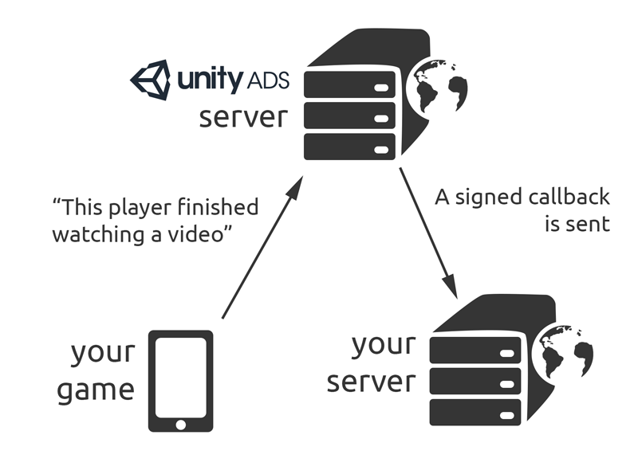

## Unity Ads Server-to-Server (S2S) Redeem Callbacks



服务器端回调会在游戏玩家完整观看了一个广告后，发送到您的服务器。您可以使用这些回调作为奖励玩家的依据，和检测并预防玩家作弊。


> **提示：**
> 目前服务器端回调设置还没有在开发者后台开放。
> 如果您有游戏需要设置，请联系广告[技术支持](mailto:unityads-support@unity3d.com)并提供以下信息：
> **Unity Game ID**
> **callback URL(s)**
> 我们会回复您一个用于签名和验证回调的秘钥。

在您的游戏玩家完整观看了一个广告后，Unity Ads服务器会发送一个签名回调至您提供的URL。这个过程会在广告即将播放结束前完成，以便能够在玩家返回游戏前完成奖励流程。但请在广告播放完毕后再提示玩家领取激励，以免干扰玩家观看完广告。

因网络因素，接收激励回调会有一定时延。为了使玩家有流畅的体验，请在广告播放完毕后立刻下发奖励，然后使用服务器端回调作为防作弊用途。

想要使用服务器端回调，您需要在展示广告前设置 **server ID (sid)**。

Unity 集成样例：

```
using UnityEngine;
using System.Collections;
using UnityEngine.Advertisements;

public class UnityAdsManager : MonoBehaviour
{
    // an integer string of usually 5-7 digits, example: "12345"
    public string gameId;
    public string placement = "rewardedVideo"

    // Call this function when Advertisement.IsReady == true
    public void showAd() {

        ShowOptions options = new ShowOptions();

        // setting the server ID
        options.gamerSid = "example";

        Advertisement.Show (placement, options);
    }
}
```

在 Android 和 iOS 原生集成环境下，则需要使用 Unity Ads SDK的 `PlayerMetaData` 类实现。

Android 实现样例：

```
if(UnityAds.isReady()) {
        PlayerMetaData playerMetaData = new PlayerMetaData(context);
        playerMetaData.setServerId("example");
        playerMetaData.commit();

        UnityAds.show(activity);
    }
```

iOS 实现样例：

```
if([UnityAds isReady]) {
        id playerMetaData = [[UADSPlayerMetaData alloc] init];
        [playerMetaData setServerId:@"example"];
        [playerMetaData commit];

        [UnityAds show:self];
    }
```

### 回调来源

服务器端回调是从 https://static.applifier.com/public_ips.json 内的 IP地址/网络发出，这些IP地址/网络会在每月第一天更新。开发者可以放心的忽略或屏蔽从其他地方发送来的回调。

### 回调格式

回调请求是一个如下格式的 **HTTP/1.1 GET 请求**：

> [CALLBACK_URL][SEPARATOR1]sid=[SID][SEPARATOR]oid=[OID][SEPARATOR]hmac=[SIGNATURE]

格式中的各参数值的解释：

| 参数         | 内容                                                         |
| ------------ | ------------------------------------------------------------ |
| CALLBACK_URL | 回调的base URL, 例如： `https://developer.example.com/award.php?productid=1234` 设置此URL需要联系[广告技术支持](https://github.com/unity-cn/unityads-help-cn/wiki/chinese_sdk_metadata_s2s_callbacks#setup-callback)。 |
| SEPARATOR1   | ? 或者 & 如果 base URL 里没有使用 ? 则使用 ? 否则使用 &      |
| SID          | 玩家ID 或 其他任何您想要发送至您服务器的数据项，比如 `1234567890`。 上文中的代码样例展示了如何在不同平台上设置 server ID。 |
| SEPARATOR    | &                                                            |
| OID          | Unity Ads 服务器生成的唯一 Offer ID, 比如 `0987654321`       |
| SIGNATURE    | 一个 HDMAC-MD5 加密的字符串，比如 `106ed4300f91145aff6378a355fced73` |

回调样例：
https://developer.example.com/award.php?productid=1234&sid=1234567890&oid=0987654321&hmac=106ed4300f91145aff6378a355fced73

### 回调签名

回调请求里有一个签名参数。这个签名是通过对，串联回调URL里除`hmac`外的所有key=value参数对(以字母顺序排序，英文逗号`,`分隔)得到的字符串，进行 HDMAC-MD5 加密得到的。

例如：
`https://developer.example.com/award.php?productid=1234&sid=1234567890&oid=0987654321`

串联 参数对 得到字符串 (字母顺序排序，英文逗号`,`隔开)
`oid=0987654321,productid=1234,sid=1234567890`

以密钥`xyzKEY`加密字符串得到签名 ([技术支持](https://github.com/unity-cn/unityads-help-cn/wiki/chinese_sdk_metadata_s2s_callbacks#setup-callback)在帮您设置回调时会为您提供这个密钥)
`106ed4300f91145aff6378a355fced73`

最终发送的回调URL为：
https://developer.example.com/award.php?productid=1234&sid=1234567890&oid=0987654321&hmac=106ed4300f91145aff6378a355fced73

> **注意：**
> 在生成签名时，请包含回调URL中的所有的参数（除hmac），并以字母顺序排列，用英文逗号`,`隔开。否则生成的签名将无法匹配。

### 回调响应

如果回调通过了全部验证且玩家拿到了游戏奖励，请返回 HTTP/1.1 200 OK，同时在返回的 body 里包含字符 “1″:

```
HTTP/1.1 200 OK
Date: Wed, 22 Feb 2012 23:59:59 GMT
Content-Length: 8

1
```

如果出现错误，则需要返回 400- 或 500- 段的 HTTP error 并包含可读的报错信息 (例如，OID已经使用过；签名不匹配；或其他任何导致玩家无法获得奖励的报错):

```
HTTP/1.1 400 ERROR
Date: Wed, 22 Feb 2012 23:59:59 GMT
Content-Length: 12

Duplicate order  
```

### 回调验证样例

#### `node.js`

下面举例如何使用 node.js + express 实现签名验证：

```
// NODE.js S2S callback endpoint sample implementation
// Unity Ads

var express = require('express');
var crypto = require('crypto')
var app = express();


app.listen(process.env.PORT || 3412);

function getHMAC(parameters, secret) {
    var sortedParameterString = sortParams(parameters);
    return crypto.createHmac('md5', secret).update(sortedParameterString).digest('hex');
}

function sortParams(parameters) {
    var params = parameters || {};
    return Object.keys(params)
        .filter(key => key !== 'hmac')
        .sort()
        .map(key => params[key] === null ? `${key}=` : `${key}=${params[key]}`)
        .join(',');
}

app.get('/', function (req, res) {

    var sid = req.query.sid;
    var oid = req.query.oid;
    var hmac = req.query.hmac;

    // Save the secret as an environment variable. If none is set, default to xyzKEY
    var secret = process.env.UNITYADSSECRET || 'xyzKEY';

    var newHmac = getHMAC(req.query, secret);

    if (hmac === newHmac) {
        // Signatures match

        // Check for duplicate oid here (player already received reward) and return 403 if it exists

        // If there's no duplicate - give virtual goods to player. Return 500 if it fails.

        // Save the oid for duplicate checking. Return 500 if it fails.

        // Callback passed, return 200 and include '1' in the message body
        res.status(200).send('1');

    } else {
        // no match
        res.sendStatus(403);
    }

});
```

#### PHP

下面举例如何使用 PHP 实现签名验证：

```
<?php
function generate_hash($params, $secret) {
   ksort($params); // All parameters are always checked in alphabetical order
   $s = '';
   foreach ($params as $key => $value) {
     $s .= "$key=$value,";
   }
   $s = substr($s, 0, -1);
   $hash = hash_hmac('md5', $s, $secret);
   return $hash;
}

$hash = $_GET['hmac'];
unset($_GET['hmac']);
$signature = generate_hash($_GET, 'xyzKEY'); // insert here the secret hash key you received from Unity Ads support
error_log("req hmac".$hash);
error_log("sig hmac".$signature);

// check signature
if($hash != $signature) { header('HTTP/1.1 403 Forbidden'); echo "Signature did not match"; exit; }

// check duplicate orders
if(check_duplicate_orders($_GET['oid']) { header('HTTP/1.1 403 Forbidden'); echo "Duplicate order"; exit; }

// if not then give the player the item and check that it succeeds.
if(!give_item_to_player($_GET['sid'], $_GET['product']) { header('HTTP/1.1 500 Internal Server Error'); echo "Failed to give item to the player"; exit; }

// save the order ID for duplicate checking
if(save_order_number($_GET['oid']) { header('HTTP/1.1 500 Internal Server Error'); echo "Order ID saving failed, user granted item"; exit; }

// everything OK, return "1"
header('HTTP/1.1 200 OK');
echo "1";
?>
```

###  Pages 57

## [Home](https://github.com/unity-cn/unityads-help-cn/wiki/Home)

## 置顶

- [Unity Ads与GDPR](https://github.com/unity-cn/unityads-help-cn/wiki/gdpr)
- [流量变现常见问题(中文FAQ)](https://github.com/unity-cn/unityads-help-cn/wiki/monetization)
- [《基本操作与集成手册》](https://github.com/unity-cn/unityads-help-cn/blob/master/Unity Ads Integration Manual.pdf)
- [《Unity Ads 开发者后台操作手册》](https://github.com/unity-cn/unityads-help-cn/blob/master/Unity Ads Operate Dashboard Manual.pdf)
- [开发者合同下载](https://share.unity.com/receive/?thread=6VCS-3MAW&packageCode=NBDG5ztN64jvvtm9eRlXZaZXvanNjXbSIaK8ahKVXls#keyCode=LKVscTnlAyR6YU7gW3zT1j5xE-CIpdTeQkRzhZsw410)

## 头条

- 2019.07.19, 添加了[COPPA设置及其影响](https://github.com/unity-cn/unityads-help-cn/wiki/coppa)
- 2019.07.10, 添加了[Unity中app-ads.txt设置指南](https://github.com/unity-cn/unityads-help-cn/wiki/app-ads-txt-guide)
- 2019.07.04, 更新了[《Unity Ads 开发者后台操作完全手册》](https://github.com/unity-cn/unityads-help-cn/blob/master/Unity Ads Operate Dashboard Manual.pdf)
- 2019.07.04, 更新了[《基本操作与集成手册》](https://github.com/unity-cn/unityads-help-cn/blob/master/Unity Ads Integration Manual.pdf)
- 2019.03.28, 更新[提款流程](https://github.com/unity-cn/unityads-help-cn/wiki/RevenueAndPayment)文档
- 2018.09.30, 增加了[应用被Google Play下架处理办法](https://github.com/unity-cn/unityads-help-cn/wiki/PrivacyPolicyforGooglePlay)
- 2018.09.29, 增加了[黑屏广告处理办法](https://github.com/unity-cn/unityads-help-cn/wiki/black-screen-steps)
- 2018.09.14, 更新了[《Unity Ads 开发者后台操作完全手册》](https://github.com/unity-cn/unityads-help-cn/blob/master/Unity Ads Operate Dashboard Manual.pdf)
- 2018.09.12, 更新了[《基本操作与集成手册》](https://github.com/unity-cn/unityads-help-cn/blob/master/Unity Ads Integration Manual.pdf)
- 2018.06.01, 更新[提款流程](https://github.com/unity-cn/unityads-help-cn/wiki/RevenueAndPayment)文档，Unity Ads现在支持自动付款。
- 2018.05.29, 新增关于GDPR的文档[Unity Ads与GDPR](https://github.com/unity-cn/unityads-help-cn/wiki/gdpr)
- 2018.02.28, 新增[变现盈利与提款流程](https://github.com/unity-cn/unityads-help-cn/wiki/RevenueAndPayment)。
- 2018.02.28, 新增[变现与统计数据分析](https://github.com/unity-cn/unityads-help-cn/wiki/MonetizationStatistics)。
- 2018.02.13, 新增[广告位与广告过滤说明文档](https://github.com/unity-cn/unityads-help-cn/wiki/PlacementsAndFilters)。
- 2018.02.13, 新增简单版后台操作手册[Unity Ads后台简介](https://github.com/unity-cn/unityads-help-cn/wiki/DashboardGuide)。
- 2017.11.17, Unity Ads 流量变现指南新增[移动视频广告白皮书](https://github.com/unity-cn/unityads-help-cn/blob/master/Unity Ad Whitepaper CN.pdf)
- 2017.11.16, 更新了[《基本操作与集成手册》](https://oc.unity3d.com/index.php/s/givVc2BgC1GiJIk)
- 2017.11.16, Unity Ads 流量变现指南新增[奖励性视频广告最佳实践](https://github.com/unity-cn/unityads-help-cn/blob/master/Best Practice.pdf)
- 2017.11.10, Unity Ads 流量变现指南新增[Unity视频广告设计指南](https://github.com/unity-cn/unityads-help-cn/wiki/Unity视频广告设计指南)
- 2017.11.9, [Unity Ads开发者后台操作手册](https://oc.unity3d.com/index.php/s/5V9GATHdLeG33IU)更新
- 2017.7.04, FAQ中所下载的invoice模板, 增加了中文注释.
- 2016.12.20, [Unity Ads 开发者后台操作完全手册
- 2016.12.14, [Unity Ads 开发者手册](https://oc.unity3d.com/index.php/s/zvY8AL2lcx0W75S)更新至2.0.
- 2016.11.11, [Unity Ads 开发者控制台](http://dashboard.unityads.unity3d.com/)增加了对简体中文的支持.
- 2016.08.18, Unity Ads SDK 2.0 正式版版已经发布了!
- 2016.08.11, [Unity Ads 中文信息站](https://unityadscn.com/)上线了. 用于发布最新通知和博文!
- 2016.08.10, [FAQ](https://github.com/unity-cn/unityads-help-cn/wiki/monetization) 中增加了如何添加测试设备
- 2016.08.01, 制作了[有中文注释的银行信息表](https://oc.unity3d.com/index.php/s/jhlYb5k4WckPGbX)
- 2016.07, 发现 Unity 5.3 的 Services window 有的时候 gameid 不更新, 所以使用 5.3 及以前 Services window 的开发者, 不要忘记对照 dashboard 上检查 gameid是否正确.

## Unity Ads 开发者, 流量变现成指导

- [移动视频广告白皮书](https://github.com/unity-cn/unityads-help-cn/blob/master/Unity Ad Whitepaper CN.pdf)
- [视频广告设计指南](https://github.com/unity-cn/unityads-help-cn/wiki/Unity视频广告设计指南)
- [广告位(Placement)的介绍](https://github.com/unity-cn/unityads-help-cn/wiki/placements)
- [统计API](https://github.com/unity-cn/unityads-help-cn/wiki/stats-api)

## Unity Ads 广告主展示广告指导

- [广告主简易手册](https://oc.unity3d.com/index.php/s/oxH6kslKw4ClfQ7)

## 常见问题（FAQ）

- [流量变现相关 FAQ](https://github.com/unity-cn/unityads-help-cn/wiki/monetization)
- [黑屏广告处理办法](https://github.com/unity-cn/unityads-help-cn/wiki/black-screen-steps)

## 其他

- [Unity Developer Network 账号变化](https://github.com/unity-cn/unityads-help-cn/wiki/account-migration-notice)

## 联系方式

- [Privacy policy](http://unity3d.com/legal/privacy-policy)
- [Unity Ads - Terms of Service for Advertisers(广告主)](https://unity3d.com/legal/ads-advertisers-terms-of-service)
- [Unity Ads - Terms of Service for Publishers(开发者)](https://unity3d.com/legal/ads-publishers-terms-of-service)
- [开发者合同下载](https://share.unity.com/receive/?thread=6VCS-3MAW&packageCode=NBDG5ztN64jvvtm9eRlXZaZXvanNjXbSIaK8ahKVXls#keyCode=LKVscTnlAyR6YU7gW3zT1j5xE-CIpdTeQkRzhZsw410)

## 咨询

- [联系方式](https://github.com/unity-cn/unityads-help-cn/wiki/contact)

##### Clone this wiki locally


- © 2020 GitHub, Inc.