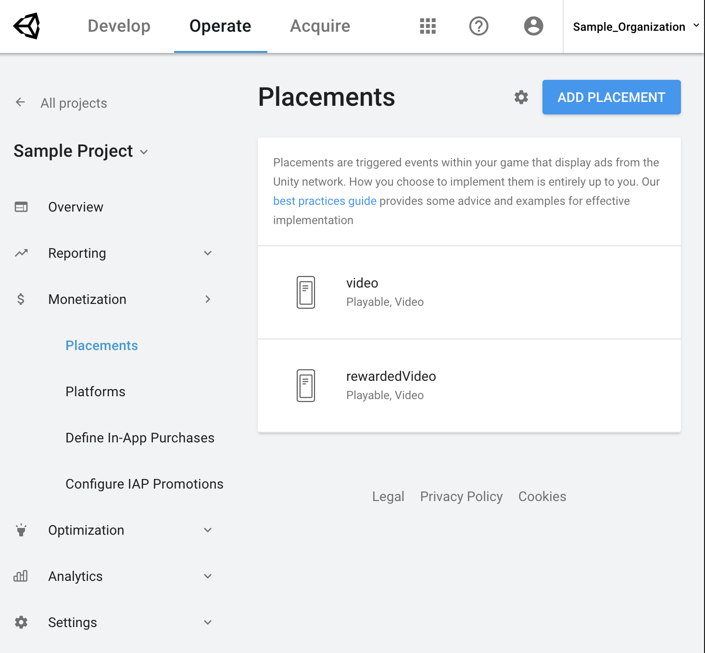
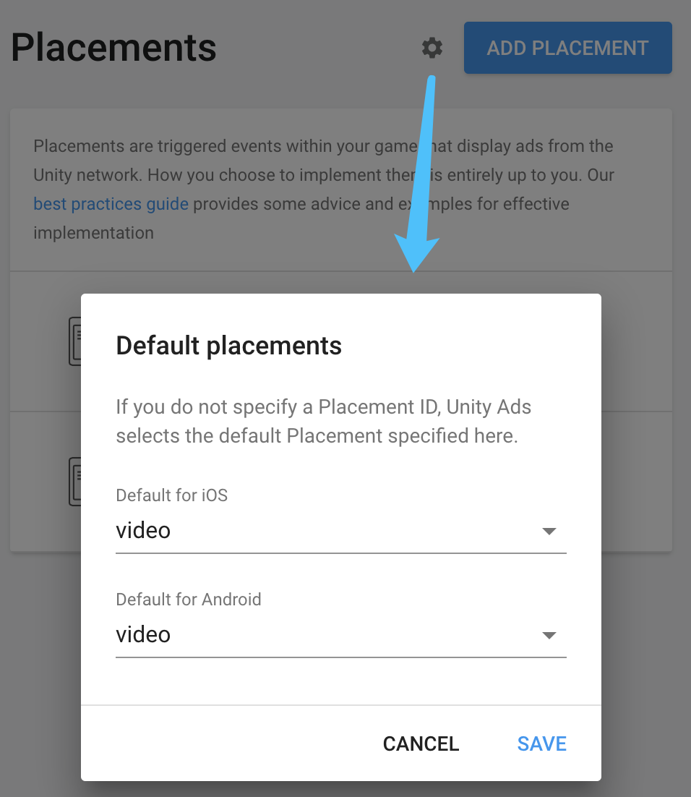
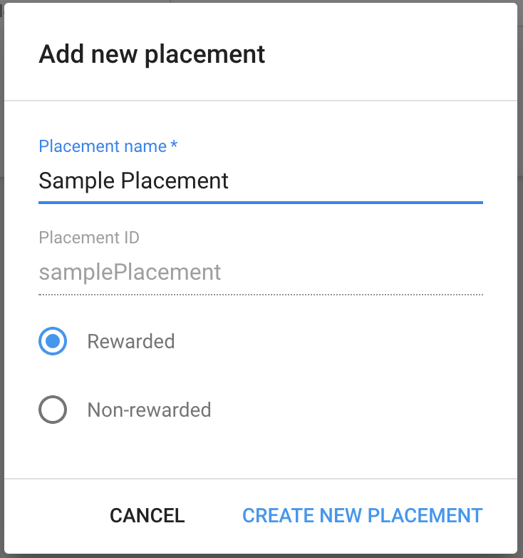
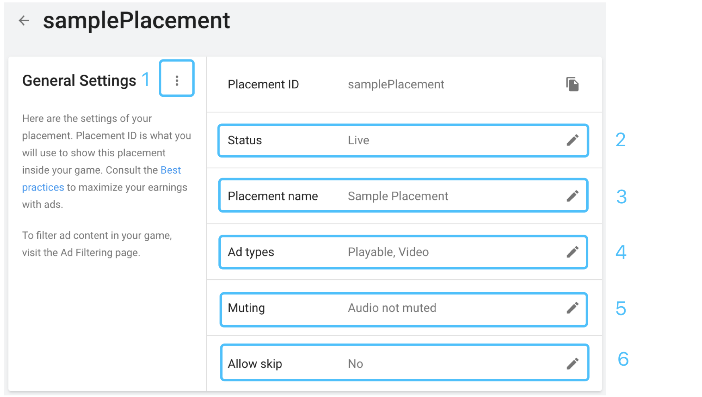
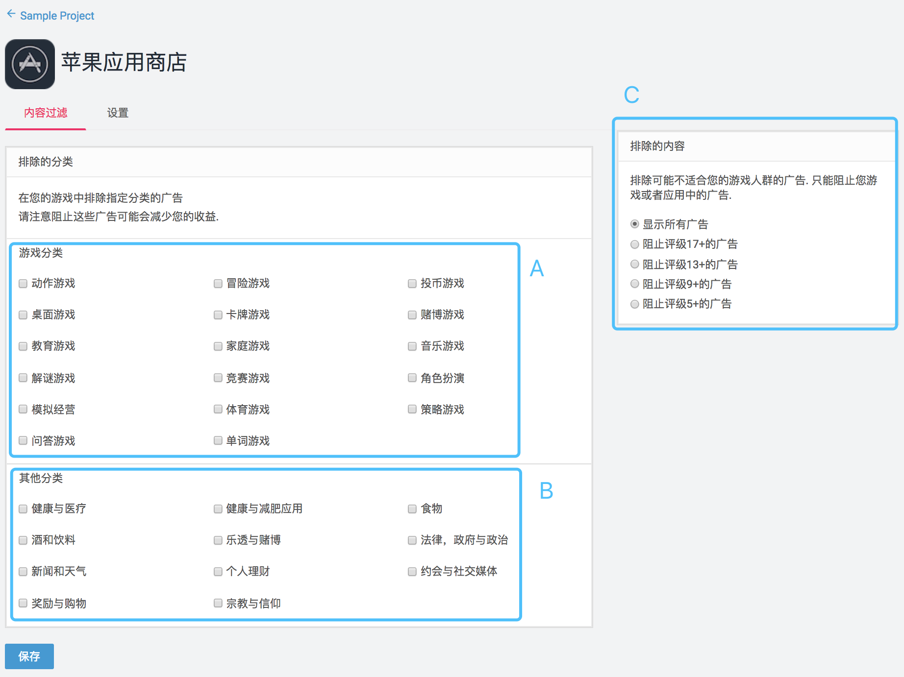

# 广告位与广告过滤

## 介绍

广告位 Placement 用于在您的游戏中展示Unity广告。如何将广告位集成到您的游戏中完全取决于开发者。我们在[Unity视频广告设计指南](https://github.com/unity-cn/unityads-help-cn/wiki/Unity视频广告设计指南)中分享了一些广告设计建议和优秀案例以供您参考。您可以在[Unity Ads后台](https://operate.dashboard.unity3d.com/)通过设置广告位属性去控制广告表现行为。

## 管理广告位

1. 在 [Operate 开发者后台](https://operate.dashboard.unity3d.com/)，选择 **Projects**，然后选中一个项目。
2. 在左侧导航栏中选择 **Monetization** > **Placements**。
3. 点击一个已有广告位进行编辑，或点击 **ADD PLACEMENT** 新建广告位。




### 默认广告位

广告位列表 显示了当前项目下的所有广告位，每个广告位都支持iOS和Android平台。新建项目默认会包含两个广告位：

- **video**，默认允许玩家在广告视频播放5秒后跳过。
- **rewardedVideo**，需要玩家主动选择观看广告以获取游戏奖励，但不可跳过观看视频。

Unity会自动指定 **video** 作为默认广告位，如果您在集成 Unity 广告代码中没有指定 placementID，Unity将使用默认广告位展示广告。
您可以通过点击广告位列表页面 ADD PLACEMENT 旁边的齿轮图标，查看和更改项目的默认广告位。



Unity Ads 通常在游戏中以奖励性视频广告位的表现更佳。请参考[Unity视频广告设计指南](https://github.com/unity-cn/unityads-help-cn/wiki/Unity视频广告设计指南)了解更多信息。

### 新建广告位

点击 **ADD PLACEMENT** , 然后在弹出窗口设置以下属性：

- 添加 **Placement name**

> **注意：**
> Unity 会根据Placement name自动生成小写字母开头的 **Placement ID**, 您[集成 Unity Ads](https://github.com/unity-cn/unityads-help-cn/wiki/PlacementsAndFilters#implement-placement)时会用到 Placement ID.
> 广告位创建后，只能修改Placement name，**不支持修改Placement ID**

- 选择广告位模板类型 Rewarded 或 Non-rewarded

> **Rewarded**，广告视频不可跳过，多用于游戏激励广告。
> **Non-rewarded**，默认允许玩家在广告视频播放5秒后跳过。



完成以上设置后，点击 **CREATE NEW PLACEMENT** 保存广告位.

### 编辑广告位

在广告位列表页面点击您想要编辑的广告位，即可查看并编辑当前广告位的属性设置。



这些广告位属性控制了广告在您游戏中展示时的行为表现，定义如下：

1. **Platform specific settings**

   想要广告位在iOS和Android平台有不同的广告行为，可以点击 **“1“** 中的更多选项图标，然后在弹出窗口点击 **USE PLATFORM SETTINGS**

   > **注意：**
   > 广告位在启用分平台管理后，您在每个平台上的修改只会影响该平台；
   > 分平台管理功能不支持回退操作，即启用后无法再合并平台管理。

2. **Status**

   广告位的默认状态是 **启用 Live** . 您可以通过编辑将其改为 **禁用 Disabled**.

3. **Placement Name**

   您可以编辑广告位名称，但不会改变 Placement ID.

4. **Ad types**

   广告位默认支持 **Video** 和 **Playable** 广告类型. 您可以通过编辑增加或减少广告类型：

   - **Video** 全屏视频广告.
   - **Display** 全屏图片广告.
   - **Playable** 全屏用户试玩广告.

   > **提示：**
   > 对于激励广告 rewarded ads, 我们建议您同时勾选 Video 和 Playable;
   > 对于插屏广告 interstitial ads, 我们建议您同时勾选 Video 和 Display ads.

5. **Muting**

   广告位默认为视频播放时有声音，用户可以通过广告页面上的静音图标随时关闭声音，且手机在静音模式时，广告也会静音. 您可以通过编辑 勾选 **Mute audio** 设置广告视频播放时默认静音。

6. **Allow skip**

   点击编辑，您可以指定在视频广告播放多少秒数后显示跳过图标，以允许用户跳过观看视频。

   > **提示：**
   > 如果您设置为 **0秒** 或 **No**，则广告位成为激励广告位，用户无法跳过观看广告。

## 过滤广告内容

Unity Ads后台提供工具帮助您通过 广告年龄评级 和 广告类别 设置特定的广告过滤机制。

1. 在 [Operate 开发者后台](https://operate.dashboard.unity3d.com/)，选择 **Projects**，然后选中一个项目。
2. 在左侧导航栏中选择 **Monetization** > **Platforms**。
3. 点击一个平台，在 **内容过滤** 选项卡内进行编辑：
   - A) 勾选**游戏分类**下的选项在游戏中屏蔽某类游戏广告。
   - B) 勾选**其它分类**下的选项在游戏中屏蔽包含某类内容或主题的广告。
   - C) 勾选**排除内容**下的选项在游戏中屏蔽某些年龄评级的广告。
4. 点击 **保存** 来应用所选定的设置。



结合使用以上三种过滤类型可以有效帮助您屏蔽不想要的广告内容。比如，如果您的游戏面向的是13岁以下的玩家，可以通过勾选如下过滤设置有效降低玩家看到赌博相关内容广告的可能性：

- 游戏分类：赌博游戏
- 其它分类：乐透与赌博
- 排除内容：阻止评级13+的广告

**注意：**

> 过滤广告内容通常是有好处的，但由于它降低了可用广告范围，因此会对广告收益产生一定负面影响。想了解更多相关信息，请查看[Unity视频广告设计指南](https://github.com/unity-cn/unityads-help-cn/wiki/Unity视频广告设计指南)。

如果您对广告屏蔽功能有其他疑问，或需要屏蔽某个特定广告，请您联系[Unity Ads 支持](https://github.com/unity-cn/unityads-help-cn/wiki/unityads-support@unity3d.com)。


## 广告位集成代码

### 初始化

想要使用 Unity Ads 服务您必须先进行初始化。如果您是在 Unity编辑器 的 **Window > Services** 中启用的广告服务，Unity 会自动初始化广告；如果您是在[开发者后台](https://operate.dashboard.unity3d.com/)启用的广告服务，则必须在代码中通过调用初始化函数来初始化广告。请查看[Unity Ads 集成指南](https://github.com/unity-cn/unityads-help-cn/wiki/chinese_sdk_integration_start)了解更多信息。

### 在代码中使用广告位

想要使用指定的广告位在游戏中展示广告，需要将 **Placement ID** 作为字符串参数传入如下广告方法：

> **注意：** 请将代码参数中的 **“placementID”** 替换为您后台实际的 ID, 否则会无法展示广告。

```
// 如果广告位 placementID 准备就绪，则展示广告
if(Advertisement.IsReady(“placementID”))
{
    Advertisement.Show(“placementID”);
}
```

如果您方法中没有指定广告位，Unity 将会使用 [默认广告位](https://github.com/unity-cn/unityads-help-cn/wiki/PlacementsAndFilters#default-placement)，新建项目的默认广告位是 **video** ：

```
// 如果默认广告位准备就绪，则展示广告
if(Advertisement.IsReady())
{
    Advertisement.Show();
}
```

不同平台下的代码范例：

#### Unity (C#)

```
if(Advertisement.IsReady("placementID")) 
{
    Advertisement.Show("placementID");
}
```

#### iOS (Obj-C)

```
if ([UnityAds isReady]) 
{
    [UnityAds show:self placementId:@"placementID"];
}
```

#### Android (Java)

```
if (UnityAds.isReady()) 
{
    UnityAds.show(this, "placementID");
}
```

## 广告填充率

Unity Ads 全球平均填充率高于95%，但在美国及欧洲以外的某些地区，可能会存在因广告资源不够丰富而有时无广告填充的情况。因此我们建议在展示广告之前，一定要先检查是否有广告可用。

想了解更多关于优化广告展示的信息，请查看[Unity视频广告设计指南](https://github.com/unity-cn/unityads-help-cn/wiki/Unity视频广告设计指南)。如果您希望限制玩家每天最多可观看的广告数，请您联系[Unity Ads 支持](https://github.com/unity-cn/unityads-help-cn/wiki/unityads-support@unity3d.com)。