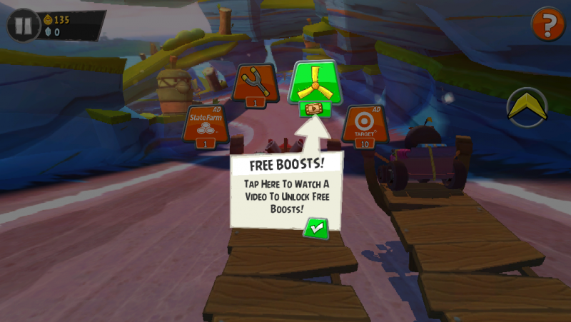

# Unity视频广告设计指南

## 选择视频广告

开发一款好的游戏仅仅只是第一步，想要制作更加专业的游戏，理解如何最大化游戏盈利才是至关重要的。本文将指导大家在不影响玩家体验的前提下，如何利用广告实现游戏盈利。其核心思想就是将广告完全无缝地融入到游戏体验之中，让用户最终爱上广告。

### 不可为之

广告非常容易打扰玩家体验。例如，横幅广告会占据屏幕空间，有时甚至会遮挡游戏关键信息，以至于玩家误点击广告。长此以往带来的恶果就是玩家很快就会忽视这一区域的显示内容。横幅广告唯一能够吸引玩家注意的方式就是通过视觉误导，通常这也会中断玩家体验。

插页广告是吸引玩家注意力最为高效的方式，但也要格外注意其出现的频率与位置。如果插页广告频率过高，就会大大增加让玩家反感的风险。这是我们不愿看到的。

插页广告并非一无是处，但我们需要了解这类广告的局限性，以及如何设计流程才能将对玩家体验的影响降至最低。偶尔让玩家休息一会，这种游戏设计反而会带来更佳的效果。在持续高度紧张的游戏过程中，玩家不可能无限保持高度集中的精力，尤其是在手机或平板等移动设备上。如果不给玩家喘息的机会，玩家可能会放弃这款游戏，甚至将其视为疲劳的代名词从此加入黑名单。长远来看，玩家需要一段自然冷却的时间。从设计角度来说，可以将玩家的参与度视为钟摆，向中心摆动时玩家参与度逐步提高，指针走到正下方时到达顶峰，然后随着指针向上摆动玩家逐渐放松，放松之后再随着钟摆回到高潮。《Dumb Ways to Die 2》就是采用这种设计的最佳案例之一。

### 视频广告

[Tilt游戏视频广告示例](https://www.bilibili.com/video/av16284638/#page=4)

在[《Dumb Ways to Die 2》](https://vid.me/y1d)中，随着玩家理解游戏机制、成功执行任务并缩短任务时间，游戏体验的紧张程度也会不断升级。如果玩家在游戏中死亡，也可以很快重新开始，但如果回到地图（带有很多小游戏菜单的界面），游戏就会展示广告。这时玩家已经做出了改变，所以对游戏体验影响最小。

对于强制性视频广告来说，至关重要的是允许跳过，并且让玩家明确知道视频的剩余时长，从而避免引起玩家反感。这种广告并未绑定任何游戏奖励，与我们将要介绍的大多广告都不太一样，但其对于那些没有货币系统的游戏或应用内购来说非常适用。然而，这种方式需要中断玩家体验，并且受限的不仅仅是我们可以展示广告的频率，还会影响玩家的参与度。选择这样做也会大大影响我们希望玩家观看广告的初衷。

### 主动观看广告

有些因素会影响玩家观看广告的意愿。首先，广告内容必须与游戏相关。例如，向游戏玩家展示其它游戏广告，且广告时间要短，在15～30秒之间。但同时玩家也要从中获取一些奖励，可以是一定数量的金币、游戏资源或生命值。并且这些奖励要与玩家息息相关且可重复获得，以便于玩家再次主动观看广告。如果观看广告就可以解锁某个**关键道具**或新关卡,对于玩家来说当然非常有益，但可能无法驱动大量的观看来为开发者赚取相应的收益。无独有偶，如果仅凭观看广告就可以解锁游戏的大量资源，也会影响整个游戏平衡。

游戏《Angry Birds Go!》利用视频广告让玩家获取免费道具，但仅在每次游戏开始时。这种设计不会抢了游戏体验的风头，但也会让玩家将注意力从游戏策略转移到视频播放上。这种激励机制非常清晰：如果想在下次游戏中使用道具，就需要花些时间来观看广告。

另外一些游戏选择在游戏结束时播放广告。例如[《Sonic Dash》](https://vid.me/DGj7)，玩家可以在“死”后通过“复活”按钮或观看广告来继续进行游戏。广告让玩家可以从紧张刺激的游戏体验中得到短暂休息，也有助于玩家之后的游戏表现。

更重要的是，观看视频广告后获得奖励本质上就是游戏体验的一部分。玩家不用下载广告中的游戏就可以获得奖励，如果下载一定是因为玩家真正感兴趣。这样做最终会为开发者带来可观收入，同时也有利于保持玩家的参与度。

### 加入激励

[跑酷游戏视频广告示例](https://www.bilibili.com/video/av16284638/index_4.html#page=2)

这让我们有了新的认识，就是观看视频广告获得的奖励必须具有吸引力，而且是玩家想要的。在游戏《Angry Birds Transformers》中，成功跑完一局后玩家会有面板显示玩家分数，并提供观看视频让分数翻倍的机会。对于这类动作游戏来说，这是在游戏过程与广告体验中奖励玩家的完美方式。

### 实用收益

有时奖励也可以与游戏中的关键动作相关联。在重玩率极高的游戏[《Retry》](https://vid.me/7Cr6)中，玩家可以选择用金币或观看视频回放的方式来解锁下一个进度点。这种奖励对玩家来说就非常实用。在游戏成功或失败的关键时刻，能有效避免玩家为了达到进度点而多次重复游戏带来的痛苦。这一技巧的关键就是理解玩家所需，以让玩家非常愿意重复的方式来助其获得奖励，例如解锁下个进度点，或是在赛车游戏中为玩家补充燃料。《Retry》中观看视频广告的案例直接提供了玩家所需，但这并不适用于所有游戏，也很难复制。其它游戏则是利用视频来加速玩家获得某些游戏货币或资源的过程，这也是一种间接体现奖励价值所在的方式。

### 免费金币

[获取免费金币的视频广告示例](https://www.bilibili.com/video/av16284638/index_4.html#page=1)

[《Hill Climb Racing》](https://vid.me/g1j)等游戏表明，游戏内货币对玩家来说是有真正价值的。它可以帮助玩家获得新车型、燃料、地图以及其它奖励。这些都是短期内一次性获得的资源，对于游戏变现来说是完美选择。但也有例外，有些游戏货币就相当于玩家游戏进度的代理。如果将其作为观看视频的奖励就有些难度。在游戏《Hill Climb Racing》中他们更加强调购买金币而非获得“免费金币”，将“免费金币”作为购买行为的最终选项。对于有些游戏来说，这种做法可能会适得其反，更佳的方式是观看视频来获得金币或游戏资源。

作为一名游戏设计师，要牢记为玩家提供有价值的内容，这意味着我们必须非常了解玩家获得新资源对游戏经济系统带来的影响。我们有必要为了支持这样的激励广告来平衡游戏经济，这就相当于为游戏添加新的资源生成器。

### 最佳案例

[天天过马路集成视频广告示例](https://www.bilibili.com/video/av16284638/index_4.html#page=3)

由Hipster Whale开发的优秀游戏[《天天过马路》](https://vid.me/ZKPU)充分说明了接入广告完全不用牺牲用户体验。我们可以事先告诉玩家观看广告带来的收益，这样毫不突兀，玩家也可以自行选择。可以在结算页的分数及重新开始旁边放上广告选项。该选项并非随时可见，所以玩家不需要主动忽视它。还会给予玩家动机，因为可能只要“56个金币”就可以获得一个随机角色，而观看广告可以直接获得20个金币。玩家不会觉得反感，而是被激励。在《天天过马路》中观看广告成为了一种娱乐，同时也是发现新道具的方式，还可以通过拉杆来获得新角色。损失的金币通过观看广告就可以轻松赚回来，玩家也会乐在其中。

### 简而言之

为游戏添加视频广告的设计流程与其它游戏功能一样，我们需要考虑以下问题：

- 这对玩家有何好处？
- 这对玩家体验有何影响？
- 这种激励是否可以放大？
- 如何保证它不会打扰游戏体验？

希望以上内容对大家有帮助。有兴趣的读者还可观看下面的视频了解更多信息：

[游戏视频广告设计指南分享](https://www.bilibili.com/video/av16284638/index_4.html#page=5)

原文链接：https://blogs.unity3d.com/cn/2015/04/15/a-designers-guide-to-using-video-ads/